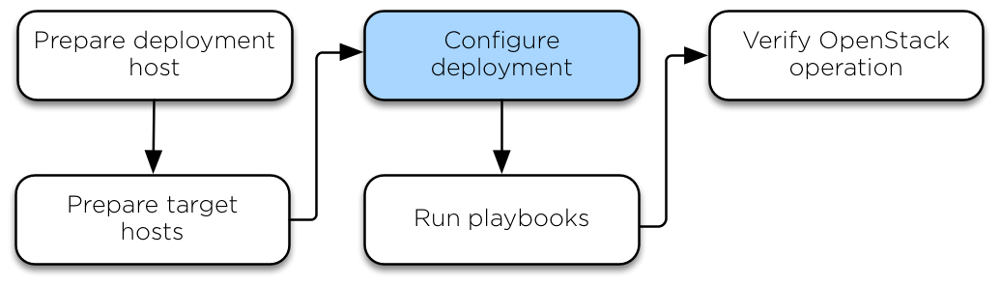

.. _configure:

========================
Configure the deployment
========================

Ansible references some files that contain mandatory and optional
configuration directives. Before you can run the Ansible playbooks, modify
these files to define the target environment. Configuration tasks include:

* Target host networking to define bridge interfaces and
  networks.
* A list of target hosts on which to install the software.
* Virtual and physical network relationships for OpenStack
  Networking (neutron).
* Passwords for all services.

Initial environment configuration
~~~~~~~~~~~~~~~~~~~~~~~~~~~~~~~~~

OpenStack-Ansible (OSA) depends on various files that are used to build an
inventory for Ansible. Perform the following configuration on the deployment
host.

#. Copy the contents of the
   ``/opt/openstack-ansible/etc/openstack_deploy`` directory to the
   ``/etc/openstack_deploy`` directory.

#. Change to the ``/etc/openstack_deploy`` directory.

#. Copy the ``openstack_user_config.yml.example`` file to
   ``/etc/openstack_deploy/openstack_user_config.yml``.

#. Review the ``openstack_user_config.yml`` file and make changes
   to the deployment of your OpenStack environment.

   .. note::

      This file is heavily commented with details about the various options.
      See our :dev_docs:`User Guide <user/index.html>` and
      :dev_docs:`Reference Guide <reference/index.html>` for more details.

#. Review the ``user_variables.yml`` file to configure global and role specific
   deployment options. The file contains some example variables and comments but
   you can get the full list of variables in each role's specific documentation.

   .. note::

      One important variable is the ``install_method`` which configures the installation
      method for the OpenStack services. The services can either be deployed from
      source (default) or from distribution packages. Source based deployments are closer
      to a vanilla OpenStack installation and allow for more tweaking and customizations. On
      the other hand, distro based deployments generally provide a package combination which
      has been verified by the distributions themselves. However, this means that updates are
      being released less often and with a potential delay. Moreover, this method might offer
      fewer opportunities for deployment customizations. The ``install_method`` variable is set
      during the initial deployment and you **must not** change it as OpenStack-Ansible is not
      able to convert itself from one installation method to the other. As such, it's
      important to judge your needs against the pros and cons of each method before making
      a decision. Please note that the ``distro`` installation method was introduced during
      the Rocky cycle, and as a result of which, Ubuntu 16.04 is not supported due to the
      fact that there are no Rocky packages for it.

The configuration in the ``openstack_user_config.yml`` file defines which hosts
run the containers and services deployed by OpenStack-Ansible. For
example, hosts listed in the ``shared-infra_hosts`` section run containers for
many of the shared services that your OpenStack environment requires. Some of
these services include databases, Memcached, and RabbitMQ. Several other
host types contain other types of containers, and all of these are listed
in the ``openstack_user_config.yml`` file.

Some services, such as glance, heat, horizon and nova-infra, are not listed
individually in the example file as they are contained in the os-infra hosts.
You can specify image-hosts or dashboard-hosts if you want to scale out in a
specific manner.

For examples, please see our :dev_docs:`User Guides <user/index.html>`

For details about how the inventory is generated, from the environment
configuration and the variable precedence, see our
:dev_docs:`Reference Guide <reference/index.html>` under the inventory
section.

Installing additional services
~~~~~~~~~~~~~~~~~~~~~~~~~~~~~~

To install additional services, the files in
``etc/openstack_deploy/conf.d`` provide examples showing
the correct host groups to use. To add another service, add the host group,
allocate hosts to it, and then execute the playbooks.

Advanced service configuration
~~~~~~~~~~~~~~~~~~~~~~~~~~~~~~

OpenStack-Ansible has many options that you can use for the advanced
configuration of services. Each role's documentation provides information
about the available options.

.. important::

   This step is essential to tailoring OpenStack-Ansible to your needs
   and is generally overlooked by new deployers. Have a look at each
   role documentation, user guides, and reference if you want a tailor
   made cloud.

Infrastructure service roles
----------------------------

- :role_docs:`galera_server`

- :role_docs:`haproxy_server`

- :role_docs:`memcached_server`

- :role_docs:`rabbitmq_server`

- :role_docs:`repo_server`

- :role_docs:`rsyslog_server`

OpenStack service roles
-----------------------

- :role_docs:`os_aodh`

- :role_docs:`os_barbican`

- :role_docs:`os_ceilometer`

- :role_docs:`os_cinder`

- :role_docs:`os_designate`

- :role_docs:`os_glance`

- :role_docs:`os_gnocchi`

- :role_docs:`os_heat`

- :role_docs:`os_horizon`

- :role_docs:`os_ironic`

- :role_docs:`os_keystone`

- :role_docs:`os_magnum`

- :role_docs:`os_masakari`

- :role_docs:`os_neutron`

- :role_docs:`os_nova`

- :role_docs:`os_octavia`

- :role_docs:`os_panko`

- :role_docs:`os_rally`

- :role_docs:`os_sahara`

- :role_docs:`os_swift`

- :role_docs:`os_tempest`

- :role_docs:`os_trove`

Other roles
-----------

- :role_docs:`apt_package_pinning`

- :role_docs:`ceph_client`

- :role_docs:`galera_client`

- :role_docs:`lxc_container_create`

- :role_docs:`lxc_hosts`

- :role_docs:`plugins`

- :role_docs:`openstack_hosts`

- :role_docs:`openstack_openrc`

- :role_docs:`rsyslog_client`

Configuring service credentials
~~~~~~~~~~~~~~~~~~~~~~~~~~~~~~~

Configure credentials for each service in the
``/etc/openstack_deploy/user_secrets.yml`` file. Consider using the
`Ansible Vault <http://docs.ansible.com/playbooks_vault.html>`_ feature to
increase security by encrypting any files that contain credentials.

Adjust permissions on these files to restrict access by non-privileged
users.

The ``keystone_auth_admin_password`` option configures the ``admin`` tenant
password for both the OpenStack API and Dashboard access.

We recommend that you use the ``pw-token-gen.py`` script to generate random
values for the variables in each file that contains service credentials:

.. code-block:: shell-session

   # cd /opt/openstack-ansible
   # ./scripts/pw-token-gen.py --file /etc/openstack_deploy/user_secrets.yml

To regenerate existing passwords, add the ``--regen`` flag.

.. warning::

   The playbooks do not currently manage changing passwords in an existing
   environment. Changing passwords and rerunning the playbooks will fail
   and might break your OpenStack environment.
