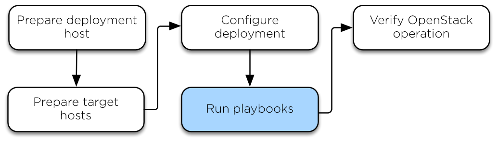

.. _run-playbooks:

=============
Run playbooks
=============

The installation process requires running three main playbooks:

- The ``openstack.osa.setup_hosts`` Ansible foundation playbook prepares the target
  hosts for infrastructure and OpenStack services, builds and restarts
  containers on target hosts, and installs common components into containers
  on target hosts.

- The ``openstack.osa.setup_infrastructure`` Ansible infrastructure playbook installs
  infrastructure services: Memcached, the repository server, Galera and
  RabbitMQ.

- The ``openstack.osa.setup_openstack`` OpenStack playbook installs OpenStack services,
  including Identity (keystone), Image (glance), Block Storage (cinder),
  Compute (nova), Networking (neutron), etc.

Checking the integrity of the configuration files
~~~~~~~~~~~~~~~~~~~~~~~~~~~~~~~~~~~~~~~~~~~~~~~~~

Before running any playbook, check the integrity of the configuration files.

#. Ensure that all the files edited in the ``/etc/openstack_deploy`` directory are
   Ansible `YAML compliant <http://docs.ansible.com/ansible/YAMLSyntax.html>`_.

#. Check the integrity of your YAML files.

   .. note::

      To check your YAML syntax online, you can use the `YAML Lint program <http://www.yamllint.com/>`_.

#. Run the following command:

   .. code-block:: console

      # openstack-ansible openstack.osa.setup_infrastructure --syntax-check

#. Recheck that all indentation is correct. This is important because the
   syntax of the configuration files can be correct while not being meaningful
   for OpenStack-Ansible.

Run the playbooks to install OpenStack
~~~~~~~~~~~~~~~~~~~~~~~~~~~~~~~~~~~~~~

#. Run the host setup playbook:

   .. code-block:: console

       # openstack-ansible openstack.osa.setup_hosts

   Confirm satisfactory completion with zero items unreachable or
   failed:

   .. code-block:: console

       PLAY RECAP ********************************************************************
       ...
       deployment_host                :  ok=18   changed=11   unreachable=0    failed=0

#. Run the infrastructure setup playbook:

   .. code-block:: console

      # openstack-ansible openstack.osa.setup_infrastructure

   Confirm satisfactory completion with zero items unreachable or
   failed:

   .. code-block:: console

      PLAY RECAP ********************************************************************
      ...
      deployment_host                : ok=27   changed=0    unreachable=0    failed=0

#. Run the following command to verify the database cluster:

   .. note::

      In order to run ad-hoc commands, you need to execute command from the
      location of ``openstack-ansible`` repository (ie `/opt/openstack-ansible`)
      or explicitly load required envirnoment variables for Ansible configuration
      through ``source /usr/local/bin/openstack-ansible.rc``.

   .. code-block:: console

      # ansible galera_container -m shell \
        -a "mariadb -h localhost -e 'show status like \"%wsrep_cluster_%\";'"

   Example output:

   .. code-block:: console

      node3_galera_container-3ea2cbd3 | success | rc=0 >>
      Variable_name             Value
      wsrep_cluster_conf_id     17
      wsrep_cluster_size        3
      wsrep_cluster_state_uuid  338b06b0-2948-11e4-9d06-bef42f6c52f1
      wsrep_cluster_status      Primary

      node2_galera_container-49a47d25 | success | rc=0 >>
      Variable_name             Value
      wsrep_cluster_conf_id     17
      wsrep_cluster_size        3
      wsrep_cluster_state_uuid  338b06b0-2948-11e4-9d06-bef42f6c52f1
      wsrep_cluster_status      Primary

      node4_galera_container-76275635 | success | rc=0 >>
      Variable_name             Value
      wsrep_cluster_conf_id     17
      wsrep_cluster_size        3
      wsrep_cluster_state_uuid  338b06b0-2948-11e4-9d06-bef42f6c52f1
      wsrep_cluster_status      Primary

   The ``wsrep_cluster_size`` field indicates the number of nodes
   in the cluster and the ``wsrep_cluster_status`` field indicates
   primary.

#. Run the OpenStack setup playbook:

   .. code-block:: console

      # openstack-ansible openstack.osa.setup_openstack

   Confirm satisfactory completion with zero items unreachable or
   failed.
