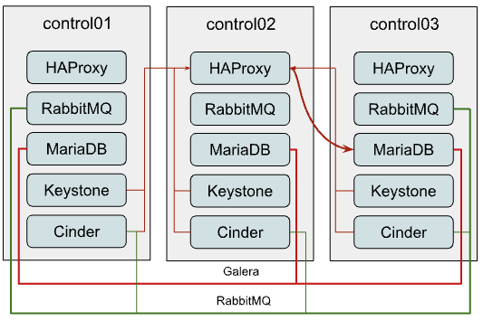
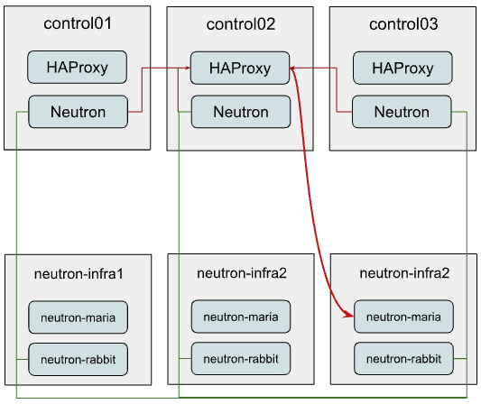
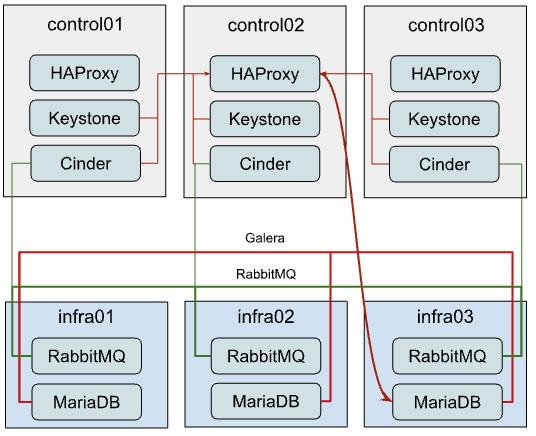
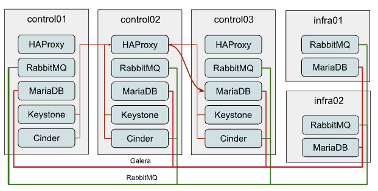

============================
Scaling MariaDB and RabbitMQ
============================

.. contents:: :backlinks: none

OpenStack is a cloud computing platform that is designed to be highly scalable.
However, even though OpenStack is designed to be scalable, there are a few
potential bottlenecks that can occur in large deployments. These bottlenecks
typically involve the performance and throughput of RabbitMQ and MariaDB
clusters.

RabbitMQ is a message broker that is used to decouple different components of
OpenStack. MariaDB is a database that is used to store data for OpenStack.
If these two components are not performing well, it can have a negative impact
on the performance of the entire OpenStack deployment.

There are a number of different methodologies that can be used to improve the
performance of RabbitMQ and MariaDB clusters. These methodologies include
scaling up the clusters, using a different message broker or database, or
optimizing the configuration of the clusters.

In this series of articles, will be discussed the potential bottlenecks that
can occur in large OpenStack deployments and ways to scale up deployments to
improve the performance of RabbitMQ and MariaDB clusters.

.. note::

   Examples provided in this documentation were made on OpenStack 2023.1
   (Antelope). It is possible to achieve the same flows in earlier releases,
   but some extra steps or slightly different configurations might be required.

.. _scaling-osa-common:

Most Common Deployment
~~~~~~~~~~~~~~~~~~~~~~

Before talking about ways on how to improve things, let’s quickly describe
“starting point”, to understand what we’re dealing with at the starting point.

The most common OpenStack-Ansible deployment design is three control nodes,
each one is running all OpenStack API services along with supporting
infrastructure, like MariaDB and RabbitMQ clusters. This is a good starting
point for small to medium-sized deployments. However, as the deployment grows,
you may start to experience performance problems. Typically communication
between services and MySQL/RabbitMQ looks like this:

**MariaDB**

As you might see on the diagram, all connections to MariaDB come through
the HAProxy which has Internal Virtual IP (VIP). OpenStack-Ansible does
configure the Galera cluster for MariaDB, which is a multi-master replication
system. Although you can issue any request to any member of the cluster, all
write requests will be passed to the current “primary” instance creating more
internal traffic and raising the amount of work each instance should do. So
it is recommended to pass write requests only to the “primary” instance.

However HAProxy is not capable of balancing MySQL queries at an application
level (L7 of OSI model), to separate read and write requests, so we have to
balance TCP streams (L3) and pass all traffic without any separation to the
current “primary” node in the Galera cluster, which creates a potential
bottleneck.

**RabbitMQ**

RabbitMQ is clustered differently. We supply IP addresses of all cluster
members to clients and it’s up to the client to decide which backend it
will use for interaction. Only RabbitMQ management UI is balanced through
haproxy, so the connection of clients to queues does not depend on HAProxy
in any way.

Though usage of HA queues and even quorum queues makes all messages and
queues to be mirrored to all or several cluster members. While quorum queues
show way better performance, they still suffer from clustering traffic which
still becomes a problem at a certain scale.

.. _scaling-osa-one:

Option 1: Independent clusters per service
~~~~~~~~~~~~~~~~~~~~~~~~~~~~~~~~~~~~~~~~~~

With this approach, you might provide the most loaded services, like Nova
or Neutron, their standalone MariaDB and RabbitMQ clusters. These new
clusters might reside on a separate hardware.

In the example below we assume that only Neutron is being reconfigured to
use the new standalone cluster, while other services remain sharing the
already existing one. So Neutron connectivity will look like this:

As you might have noticed, we still consume the same HAProxy instance for
MariaDB balancing to the new infra cluster.

Next, we will describe how to configure such a stack and execute the service
transition to this new layout.

Setup of new MariaDB and RabbitMQ clusters
------------------------------------------

To configure such a layout and migrate Neutron using it with OpenStack-Ansible
you need to follow these steps:

.. note::

   You can reference the following documentation for a deeper understanding of
   how env.d and conf.d files should be constructed: :ref:`inventory-in-depth`

* Define new groups for RabbitMQ and MariaDB. For that, you can create files
  with the following content: ``/etc/openstack_deploy/env.d/galera-neutron.yml``:

  .. code-block:: yaml

    # env.d file are more clear if you read them bottom-up
    # At component skeleton you map component to ansible groups
    component_skel:
      # Component itself is an ansible group as well
      neutron_galera:
      # You tell in which ansible groups component will appear
      belongs_to:
        - neutron_galera_all
        - galera_all

    # At container skeleton you link components to physical layer
    container_skel:
      neutron_galera_container:
        # Here you define on which physical hosts container will reside
        belongs_to:
          - neutron-database_containers
        # Here you define which components will reside on container
       contains:
         - neutron_galera

    # At physical skeleton level you map containers to hosts
    physical_skel:
      # Here you tell to which global group containers will be added
      # from the host in question.
      # Please note, that <name>_hosts and <name>_containers are
      # interconnected, and <name> can not contain underscores.
      neutron-database_containers:
        belongs_to:
          - all_containers

    # You define `<name>_hosts` in your openstack_user_config or conf.d
    # files to tell on which physical hosts containers should be spawned
    neutron-database_hosts:
      belongs_to:
        - hosts

* ``/etc/openstack_deploy/env.d/rabbit-neutron.yml``:

  .. code-block:: yaml

    # On the component level we are creating group `neutron_rabbitmq`
    # that is also part of `rabbitmq_all` and `neutron_rabbitmq_all`

    component_skel:
      neutron_rabbitmq:
        belongs_to:
          - rabbitmq_all
          - neutron_rabbitmq_all

    # On the container level we tell to create neutron_rabbitmq on
    # neutron-mq_hosts
    container_skel:
      neutron_rabbit_mq_container:
        belongs_to:
          - neutron-mq_containers
        contains:
          - neutron_rabbitmq

    # We define the physical level as a base level which can be consumed
    # by container and component skeleton.
    physical_skel:
      neutron-mq_containers:
        belongs_to:
          - all_containers
      neutron-mq_hosts:
        belongs_to:
          - hosts

Map your new neutron-infra hosts to these new groups. To add to your
``openstack_user_config.yml`` the following content:

.. code-block:: yaml

  neutron-mq_hosts: &neutron_infra
    neutron-infra1:
      ip: 172.29.236.200
    neutron-infra2:
      ip: 172.29.236.201
    neutron-infra3:
      ip: 172.29.236.202
  neutron-database_hosts: *neutron_infra

* Define some specific configurations for newly created groups and
  balance them:

* MariaDB

  * In file ``/etc/openstack_deploy/group_vars/neutron_galera.yml``:

    .. code-block:: yaml

      galera_cluster_members: "{{ groups['neutron_galera'] }}"
      galera_cluster_name: neutron_galera_cluster
      galera_root_password: mysecret

In file  ``/etc/openstack_deploy/group_vars/galera.yml``:

.. code-block:: yaml

  galera_cluster_members: "{{ groups['galera'] }}"

* Move `galera_root_password` from ``/etc/openstack_deploy/user_secrets.yml``
  to ``/etc/openstack_deploy/group_vars/galera.yml``

* RabbitMQ

  * In file ``/etc/openstack_deploy/group_vars/neutron_rabbitmq.yml``:

  .. code-block:: yaml

    rabbitmq_host_group: neutron_rabbitmq
    rabbitmq_cluster_name: neutron_cluster

  * In file ``/etc/openstack_deploy/group_vars/rabbitmq.yml``

  .. code-block:: yaml

    rabbitmq_host_group: rabbitmq

* HAProxy

  * In ``/etc/openstack_deploy/user_variables.yml`` define extra service for MariaDB:

  .. code-block:: yaml

    haproxy_extra_services:

      - haproxy_service_name: galera_neutron
        haproxy_backend_nodes: "{{ (groups['neutron_galera'] | default([]))[:1] }}"
        haproxy_backup_nodes: "{{ (groups['neutron_galera'] | default([]))[1:] }}"
        haproxy_bind: "{{ [haproxy_bind_internal_lb_vip_address | default(internal_lb_vip_address)] }}"
        haproxy_port: 3307
        haproxy_backend_port: 3306
        haproxy_check_port: 9200
        haproxy_balance_type: tcp
        haproxy_stick_table_enabled: False
        haproxy_timeout_client: 5000s
        haproxy_timeout_server: 5000s
        haproxy_backend_options:
          - "httpchk HEAD / HTTP/1.0\\r\\nUser-agent:\\ osa-haproxy-healthcheck"
        haproxy_backend_server_options:
          - "send-proxy-v2"
        haproxy_allowlist_networks: "{{ haproxy_galera_allowlist_networks }}"
        haproxy_service_enabled: "{{ groups['neutron_galera'] is defined and groups['neutron_galera'] | length > 0 }}"

    haproxy_galera_service_overrides:
      haproxy_backend_nodes: "{{ groups['galera'][:1] }}"
      haproxy_backup_nodes: "{{ groups['galera'][1:] }}"

* Prepare new infra hosts and create containers on them. For that,
  run the command:

  .. code-block:: console

     # openstack-ansible playbooks/setup-hosts.yml --limit neutron-mq_hosts,neutron-database_hosts,neutron_rabbitmq,neutron_galera

* Deploy clusters:

  * MariaDB:

    .. code-block:: console

       openstack-ansible playbooks/galera-install.yml --limit neutron_galera

  * RabbitMQ:

    .. code-block:: console

       openstack-ansible playbooks/rabbitmq-install.yml --limit neutron_rabbitmq

Migrating the service to use new clusters
-----------------------------------------

While it’s relatively easy to start using the new RabbitMQ cluster for the
service, migration of the database is slightly tricky and will include some
downtime.

First, we need to tell Neutron that from now on, the MySQL database for the
service is listening on a different port. So you should add the following
override to your ``user_variables.yml``:

.. code-block:: yaml

  neutron_galera_port: 3307

Now let’s prepare the destination database: create the database itself along
with required users and provide them permissions to interact with the database.
For that, we will run the neutron role with a common-db tag and limit execution
to the neutron_server group only. You can use the following command for that:

.. code-block:: console

   # openstack-ansible playbooks/os-neutron-install.yml --limit neutron_server --tags common-db

Once we have a database prepared, we need to disable HAProxy backends that
proxy traffic to the API of the service in order to prevent any user or
service actions with it.

For that, we use a small custom playbook. Let’s name it ``haproxy_backends.yml``:

.. code-block:: yaml

  - hosts: haproxy_all
    tasks:
      - name: Manage backends
        community.general.haproxy:
          socket: /run/haproxy.stat
          backend: "{{ backend_group }}-back"
          drain: "{{ haproxy_drain | default(False) }}"
          host: "{{ item }}"
          state: "{{ haproxy_state | default('disabled') }}"
          shutdown_sessions: "{{ haproxy_shutdown_sessions | default(False) | bool }}"
          wait: "{{ haproxy_wait | default(False) | bool }}"
          wait_interval: "{{ haproxy_wait_interval | default(5) }}"
          wait_retries: "{{ haproxy_wait_retries | default(24) }}"
        with_items: "{{ groups[backend_group] }}"

We run it as follows:

.. code-block:: console

   # openstack-ansible haproxy_backends.yml -e backend_group=neutron_server

No, we can stop the API service for Neutron:

.. code-block:: console

   # ansible -m service -a "state=stopped name=neutron-server" neutron_server

And run a backup/restore of the MySQL database for the service. For this
purpose, we will use another small playbook, that we name as
``mysql_backup_restore.yml`` with the following content:

.. code-block:: yaml

  - hosts: "{{ groups['galera'][0] }}"
    vars:
      _db: "{{ neutron_galera_database | default('neutron') }}"
    tasks:
      - name: Dump the db
        shell: "mysqldump --single-transaction {{ _db }} > /tmp/{{ _db }}"
      - name: Fetch the backup
        fetch:
          src: "/tmp/{{ _db }}"
          dest: "/tmp/db-backup/"
          flat: yes
  - hosts: "{{ groups['neutron_galera'][0] }}"
    vars:
      _db: "{{ neutron_galera_database | default('neutron') }}"
    tasks:
      - name: Copy backups to destination
        copy:
          src: "/tmp/db-backup/"
          dest: "/tmp/db-backup/"
      - name: Restore the DB backup
        shell: "mysql {{ _db }} < /tmp/db-backup/{{ _db }}"

Now let’s run the playbook we’ve just created:

.. code-block:: console

   # openstack-ansible mysql_backup_restore.yml

.. note::

    The playbook above is not idempotent as it will override database
    content on the destination hosts.

Once the database content is in place, we can now re-configure the service
using the playbook.

It will not only tell Neutron to use the new database but also will switch
it to using the new RabbitMQ cluster as well and re-enable the service in
HAProxy.

For that to happen we should run the following command:

.. code-block:: console

   # openstack-ansible playbooks/os-neutron-install.yml --tags neutron-config,common-mq

After the playbook has finished, neutron services will be started and
configured to use new clusters.

.. _scaling-osa-two:

Option 2: Dedicated hardware for clusters
~~~~~~~~~~~~~~~~~~~~~~~~~~~~~~~~~~~~~~~~~

This option will describe how to move current MariaDB and RabbitMQ clusters
to standalone nodes. This approach can be used to offload control-planes and
provide dedicated resources for clusters.

While it’s quite straightforward to establish the architecture above from
the very beginning of the deployment, flawless migration of the existing
deployment to such a setup is more tricky, as you need to migrate running
clusters to the new hardware. Since we will be performing moves one-by-one,
to preserve at least two active cluster members, the steps below should be
repeated for the other two members.

Migrating MariaDB to the new hardware
-------------------------------------

The first thing to do is to list current members of the MariaDB cluster.
For that, you can issue the following ad-hoc command:

.. code-block:: console

   # cd /opt/openstack-ansible/
   # ansible -m debug -a "var=groups['galera']" localhost
   localhost | SUCCESS => {

      "groups['galera']": [
           "control01_galera_container-68e1fc47",
           "control02_galera_container-59576533",
           "control03_galera_container-f7d1b72b"
      ]
   }

Unless overridden, the first host in the group is considered as a “bootstrap”
one. This bootstrap host should be migrated last to avoid unnecessary
failovers, so it is recommended to start the migration of hosts to the new
hardware from the last one to the first one in the output.

Once we’ve figured out the execution order, it’s time for a step-by-step guide.

* Remove the last container in the group using the following playbook:

  .. code-block:: console

     # openstack-ansible playbooks/lxc-containers-destroy.yml --limit control03_galera_container-f7d1b72b

* Clean up the removed container from the inventory:

  .. code-block:: console

     # ./scripts/inventory-manage.py -r control03_galera_container-f7d1b72b

Re-configure ``openstack_user_config`` to create a new container.

Assuming, you currently have a config like the one below in your
``openstack_user_config.yml``:

  .. code-block:: yaml

    _control_hosts: &control_hosts
      control01:
        ip: 172.29.236.11
      control02:
        ip: 172.29.236.12
      control03:
        ip: 172.29.236.13

    shared-infra_hosts: *control_hosts

Convert it to something like this:

  .. code-block:: yaml

    _control_hosts: &control_hosts
      control01:
        ip: 172.29.236.11
      control02:
        ip: 172.29.236.12
      control03:
        ip: 172.29.236.13

    memcaching_hosts: *control_hosts
    mq_hosts: *control_hosts
    operator_hosts: *control_hosts

    database_hosts:
      control01:
        ip: 172.29.236.11
      control02:
        ip: 172.29.236.12
      infra03:
        ip: 172.29.236.23

In the example above we de-couple each service that is part of the
`shared-infra_hosts` and define them separately, along with providing MariaDB
its new destination host.

* Create the container on the new infra node:

  .. code-block:: console

     # openstack-ansible playbooks/lxc-containers-create.yml --limit infra03,galera

  .. note::

     New infra hosts should be prepared before this step (i.e., by running
     ``setup-hosts.yml`` playbook against them).

* Install MariaDB to this new container and add it to the cluster:

  .. code-block:: console

     # openstack-ansible playbooks/galera-install.yml

* Once the playbook is finished, you can ensure that the cluster is in the
  **Synced** state and has proper cluster_size with the following ad-hoc:

  .. code-block:: console

     # ansible -m command -a "mysql -e \"SHOW STATUS WHERE Variable_name IN ('wsrep_local_state_comment', 'wsrep_cluster_size', 'wsrep_incoming_addresses')\"" neutron_galera

* If the cluster is healthy, repeat steps 1-6 for the rest instances,
  including the “bootstrap” one.

Migrating RabbitMQ to the new hardware
--------------------------------------

The process of RabbitMQ migration will be pretty much the same as MariaDB with
one exception – we need to preserve the same IP addresses for containers when
moving them to the new hardware. Otherwise, we would need to re-configure all
services (like cinder, nova, neutron, etc.) that rely on RabbitMQ as well, as
contrary to MariaDB which is balanced through HAProxy, it’s a client who
decides to which RabbitMQ backend it will connect.

Thus, we also don’t care about the order of migration.

Since we need to preserve an IP address, let’s collect this data before
taking any actions against the current setup:

.. code-block:: console

   # ./scripts/inventory-manage.py -l | grep rabbitmq
   | control01_rabbit_mq_container-a3a802ac  | None     | rabbitmq   | control01          | None           | 172.29.239.49  | None                 |
   | control02_rabbit_mq_container-51f6cf7c  | None     | rabbitmq   | control02          | None           | 172.29.236.82  | None                 |
   | control03_rabbit_mq_container-b30645d9  | None     | rabbitmq   | control03          | None           | 172.29.238.23  | None                 |

Before dropping the RabbitMQ container, it’s worth transitioning the RabbitMQ
instance to the Maintenance mode, so it could offload its responsibilities to
other cluster members and close connections to clients properly. You can use
the following ad-hoc for that:

.. code-block:: console

   root@deploy:/opt/openstack-ansible# ansible -m command -a "rabbitmq-upgrade drain" control01_rabbit_mq_container-a3a802ac

   control01_rabbit_mq_container-a3a802ac | CHANGED | rc=0 >>
   Will put node rabbit@control01-rabbit-mq-container-a3a802ac into maintenance mode. The node will no longer serve any client traffic!

* Now we can proceed with container removal:

  .. code-block:: console

     # openstack-ansible playbooks/lxc-containers-destroy.yml --limit control01_rabbit_mq_container-a3a802ac

* And remove it from the inventory:

  .. code-block:: console

     # ./scripts/inventory-manage.py -r control01_rabbit_mq_container-a3a802ac

Now you need to re-configure ``openstack_user_config`` similar to how it was done
for MariaDB. The resulting record at this stage for RabbitMQ should look like
this:

  .. code-block:: yaml

    mq_hosts:
      infra01:
        ip: 172.29.236.21
      control02:
        ip: 172.29.236.12
      control03:
        ip: 172.29.236.13

.. note::

   Ensure that you don’t have more generic shared-infra_hosts defined.

Now we need to manually re-generate the inventory and ensure that a new
record was mapped to our infra01:

.. code-block:: console

   # ./inventory/dynamic_inventory.py

   ...

   # ./scripts/inventory-manage.py -l | grep rabbitmq

   | control02_rabbit_mq_container-51f6cf7c  | None     | rabbitmq   | control02          | None           | 172.29.236.82  | None                 |
   | control03_rabbit_mq_container-b30645d9  | None     | rabbitmq   | control03          | None           | 172.29.238.23  | None                 |
   | infra01_rabbit_mq_container-10ec4732  | None     | rabbitmq   | infra01          | None           | 172.29.238.248 | None                 |

As you might see from the output above, a record for the new container has
been generated and assigned correctly to the infra01 host. Though this
container has a new IP address, we need to preserve it. So we manually replaced
the new IP with the old one in the inventory file and ensured it’s the proper
one now:

.. code-block:: console

   # sed -i 's/172.29.238.248/172.29.239.49/g' /etc/openstack_deploy/openstack_inventory.json
   #./scripts/inventory-manage.py -l | grep rabbitmq
   | control02_rabbit_mq_container-51f6cf7c  | None     | rabbitmq   | control02          | None           | 172.29.236.82  | None                 |
   | control03_rabbit_mq_container-b30645d9  | None     | rabbitmq   | control03          | None           | 172.29.238.23  | None                 |
   | infra01_rabbit_mq_container-10ec4732  | None     | rabbitmq   | infra01          | None           | 172.29.239.49 | None                 |

* Now you can proceed with container creation:

  .. code-block:: console

     # openstack-ansible playbooks/lxc-containers-create.yml --limit infra01,rabbitmq

* And install RabbitMQ to the new container and ensure it’s part of the cluster:

  .. code-block:: console

     # openstack-ansible playbooks/rabbitmq-install.yml

* Once the cluster is re-established, it’s worth to clean-up cluster status
  with regards to the old container name still being considered as “Disk Node”,
  since the container name has changed:

  .. code-block:: console

     # ansible -m command -a "rabbitmqctl forget_cluster_node rabbit@control01-rabbit-mq-container-a3a802ac" rabbitmq[0]

  .. note::

     You can take the cluster node name to remove from the output at step two.

* Repeat the steps above for the rest of the instances.

.. _scaling-osa-three:

Option 3: Growing Clusters Horizontally
~~~~~~~~~~~~~~~~~~~~~~~~~~~~~~~~~~~~~~~

This option is by far the least popular despite being very straightforward, as
it has a pretty narrowed use case when it makes sense to scale this way.

Though, to preserve quorum you should always have an odd number of cluster
members or be prepared to provide extra configuration if using an even number
of members.

Adding new members to the MariaDB Galera cluster
------------------------------------------------

Horizontal scaling of the MariaDB cluster makes sense only when you’re using
an L7 balancer which can work properly with Galera clusters (like ProxySQL
or MaxScale) instead of default HAProxy and the weak point of the current
cluster is read performance rather than writes.

Extending the cluster is quite trivial. For that, you need to:

#. Add another destination host in ``openstack_user_config`` for database_hosts:

   .. code-block:: yaml

     database_hosts:
       control01:
         ip: 172.29.236.11
       control02:
         ip: 172.29.236.12
       control03:
         ip: 172.29.236.13
       infra01:
         ip: 172.29.236.21
       infra02:
         ip: 172.29.236.22

#. Create new containers on the destination host:

   .. code-block:: console

      # openstack-ansible playbooks/lxc-containers-create.yml --limit infra01,infra02,galera

#. Deploy MariaDB there and add it to the cluster:

   .. code-block:: console

      # openstack-ansible playbooks/galera-install.yml

#. Ensure the cluster is healthy with the following ad-hoc:

   .. code-block:: console

      # ansible -m command -a "mysql -e \"SHOW STATUS WHERE Variable_name IN ('wsrep_local_state_comment', 'wsrep_cluster_size', 'wsrep_incoming_addresses')\"" neutron_galera

Adding new members to the RabbitMQ cluster
------------------------------------------

Growing the RabbitMQ cluster vertically makes sense mostly when you don’t
have HA queues or Quorum queues enabled.

To add more members to the RabbitMQ cluster execute the following steps:

#. Add another destination host in ``openstack_user_config`` for mq_hosts:

   .. code-block:: yaml

     mq_hosts:
       control01:
         ip: 172.29.236.11
       control02:
         ip: 172.29.236.12
       control03:
         ip: 172.29.236.13
       infra01:
         ip: 172.29.236.21
       infra02:
         ip: 172.29.236.22

#. Create new containers on the destination host:

   .. code-block:: console

      # openstack-ansible playbooks/lxc-containers-create.yml --limit infra01,infra02,rabbitmq

#. Deploy RabbitMQ on the new host and enroll it to the cluster:

   .. code-block:: console

      # openstack-ansible playbooks/rabbitmq-install.yml

#. Once a new RabbitMQ container is deployed, you need to make all services aware
   of its existence by re-configuring them. For that, you can either run individual
   service playbooks, like this:

   .. code-block:: console

      # openstack-ansible playbooks/os-<service>-install.yml –tags <service>-config

Where <service> is a service name, like neutron, nova, cinder, etc. Another
way around would be to fire up setup-openstack.yml but it will take quite some
time to execute.

.. _scaling-osa-conclusion:

Conclusion
~~~~~~~~~~

As you might see, OpenStack-Ansible is flexible enough to let you scale
a deployment in many different ways.

But which one is right for you? Well, it all depends on the situation you
find yourself in.

In case your deployment has grown to a point where RabbitMQ/MariaDB clusters
can’t simply deal with the load these clusters create regardless of the hardware
beneath them – you should use option one (:ref:`scaling-osa-one`) and make
independent clusters per service.

This option can be also recommended to improve deployment resilience – in case
of cluster failure this will affect just one service rather than each and
everyone in a common deployment use case. Another quite popular variation of
this option can be having just standalone MariaDB/RabbitMQ instances per
service, without any clusterization. The benefit of such a setup is very fast
recovery, especially when talking about RabbitMQ.

In case you are the owner of quite modest hardware specs for controllers,
you might pay more attention to option two (:ref:`scaling-osa-one`). This way you
can offload your controllers by moving heavy applications, like MariaDB/RabbitMQ,
to some other hardware that can also have relatively modest specs.

Option three (:ref:`scaling-osa-three`) can be used if your deployment meets the
requirements that were written above (ie. not using HA queues or using ProxySQL
for balancing) and usually should be considered when you’ve outgrown option
one as well.
