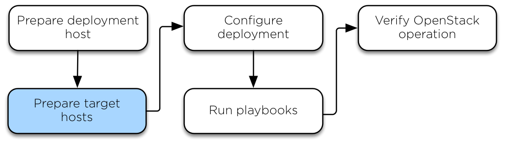

.. _target-hosts:

========================
Prepare the target hosts
========================

Configuring the operating system
================================

This section describes the installation and configuration of operating
systems for the target hosts, as well as deploying SSH keys and
configuring storage.

Installing the operating system
~~~~~~~~~~~~~~~~~~~~~~~~~~~~~~~

Install one of the following supported operating systems on the
target host:

.. raw:: HTML
    :file: supported-platforms.html

Configure at least one network interface to access the Internet or
suitable local repositories.

Some distributions add an extraneous entry in the ``/etc/hosts`` file that
resolves the actual hostname to another loopback IP address such as
``127.0.1.1``. You must comment out or remove this entry to prevent name
resolution problems. **Do not remove the 127.0.0.1 entry.**
This step is especially important for `metal` deployments.

Use short hostnames rather than fully-qualified domain names (FQDN) to
prevent length limitation issues with LXC and SSH. For example, a suitable
short hostname for a compute host might be: 12345-Compute001.

We recommend adding the Secure Shell (SSH) server packages to the
installation on target hosts that do not have local (console) access.

.. note::

   We also recommend setting your locale to `en_US.UTF-8`. Other locales might
   work, but they are not tested or supported.

Configure Debian
~~~~~~~~~~~~~~~~

#. Update package source lists

   .. code-block:: shell-session

       # apt update

#. Upgrade the system packages and kernel:

   .. code-block:: shell-session

       # apt dist-upgrade

#. Install additional software packages:

   .. code-block:: shell-session

       # apt install bridge-utils debootstrap ifenslave ifenslave-2.6 \
         lsof lvm2 openssh-server sudo tcpdump vlan python3

#. Reboot the host to activate the changes and use the new kernel.

Configure Ubuntu
~~~~~~~~~~~~~~~~

#. Update package source lists

   .. code-block:: shell-session

       # apt update

#. Upgrade the system packages and kernel:

   .. code-block:: shell-session

       # apt dist-upgrade

#. Install additional software packages:

   .. code-block:: shell-session

       # apt install bridge-utils debootstrap openssh-server \
         tcpdump vlan python3

#. Install the kernel extra package if you have one for your kernel version \

   .. code-block:: shell-session

       # apt install linux-modules-extra-$(uname -r)

#. Reboot the host to activate the changes and use the new kernel.

Configure CentOS Stream / Rocky Linux / AlmaLinux
~~~~~~~~~~~~~~~~~~~~~~~~~~~~~~~~~~~~~~~~~~~~~~~~~

#. Upgrade the system packages and kernel:

   .. code-block:: shell-session

       # dnf upgrade

#. Disable SELinux. Edit ``/etc/sysconfig/selinux``, make sure that
   ``SELINUX=enforcing`` is changed to ``SELINUX=disabled``.

     For RHEL distributions starting from version 9 the recommended
     way to disable SELinux is via the boot loader using grubby:

     .. code-block:: shell-session

        # grubby --update-kernel ALL --args selinux=0

   .. note::

      SELinux enabled is not currently supported in OpenStack-Ansible
      for CentOS/RHEL due to a lack of maintainers for the feature.

#. Disable firewalld for proper components communication:

   .. code-block:: shell-session

       # systemctl stop firewalld
       # systemctl mask firewalld

#. Install additional software packages:

   .. code-block:: shell-session

       # dnf install iputils lsof openssh-server\
         sudo tcpdump python3

#. (Optional) Reduce the kernel log level by changing the printk
   value in your sysctls:

   .. code-block:: shell-session

      # echo "kernel.printk='4 1 7 4'" >> /etc/sysctl.conf

#. Reboot the host to activate the changes and use the new kernel.

Configure SSH keys
==================

Ansible uses SSH to connect the deployment host and target hosts. You can
either use ``root`` user or any other user that is allowed to escalate
privileges through `Ansible become`_ (like adding user to sudoers).
For more details, please reffer to the `Running as non-root`_.

#. Copy the contents of the public key file on the deployment host to
   the ``~/.ssh/authorized_keys`` file on each target host.

#. Test public key authentication from the deployment host to each target
   host by using SSH to connect to the target host from the deployment host.
   If you can connect and get the shell without authenticating, it
   is working. SSH provides a shell without asking for a
   password.

For more information about how to generate an SSH key pair, as well as best
practices, see `GitHub's documentation about generating SSH keys`_.

.. _GitHub's documentation about generating SSH keys: https://help.github.com/articles/generating-ssh-keys/
.. _Ansible become: https://docs.ansible.com/ansible/latest/playbook_guide/playbooks_privilege_escalation.html
.. _Running as non-root: https://docs.openstack.org/openstack-ansible/latest/user/security/non-root.rst

Configuring the storage
=======================

`Logical Volume Manager (LVM)`_ enables a single device to be split into
multiple logical volumes that appear as a physical storage device to the
operating system. The Block Storage (cinder) service, and LXC containers
that optionally run the OpenStack infrastructure,
can optionally use LVM for their data storage.

.. note::

   OpenStack-Ansible automatically configures LVM on the nodes, and
   overrides any existing LVM configuration. If you had a customized LVM
   configuration, edit the generated configuration file as needed.

#. To use the optional Block Storage (cinder) service, create an LVM
   volume group named ``cinder-volumes`` on the storage host. Specify a metadata
   size of 2048 when creating the physical volume. For example:

   .. code-block:: shell-session

       # pvcreate --metadatasize 2048 physical_volume_device_path
       # vgcreate cinder-volumes physical_volume_device_path

#. Optionally, create an LVM volume group named ``lxc`` for container file
   systems and set ``lxc_container_backing_store: lvm`` in user_variables.yml
   if you want to use LXC with LVM. If the ``lxc`` volume group does not
   exist, containers are automatically installed on the file system under
   ``/var/lib/lxc`` by default.

.. _Logical Volume Manager (LVM): https://en.wikipedia.org/wiki/Logical_Volume_Manager_(Linux)

Configuring the network
=======================

OpenStack-Ansible uses bridges to connect physical and logical network
interfaces on the host to virtual network interfaces within containers.
Target hosts need to be configured with the following network bridges:

+-------------+-----------------------+-------------------------------------+
| Bridge name | Best configured on    | With a static IP                    |
+=============+=======================+=====================================+
| br-mgmt     | On every node         | Always                              |
+-------------+-----------------------+-------------------------------------+
|             | On every storage node | When component is deployed on metal |
+ br-storage  +-----------------------+-------------------------------------+
|             | On every compute node | Always                              |
+-------------+-----------------------+-------------------------------------+
|             | On every network node | When component is deployed on metal |
+ br-vxlan    +-----------------------+-------------------------------------+
|             | On every compute node | Always                              |
+-------------+-----------------------+-------------------------------------+
|             | On every network node | Never                               |
+ br-vlan     +-----------------------+-------------------------------------+
|             | On every compute node | Never                               |
+-------------+-----------------------+-------------------------------------+

For a detailed reference of how the host and container networking is
implemented, refer to
:dev_docs:`OpenStack-Ansible Reference Architecture, section Container Networking <reference/architecture/index.html>`.

For use case examples, refer to
:dev_docs:`User Guides <user/index.html>`.

Host network bridges information
~~~~~~~~~~~~~~~~~~~~~~~~~~~~~~~~

*  LXC internal: ``lxcbr0``

   The ``lxcbr0`` bridge is **required** for LXC, but OpenStack-Ansible
   configures it automatically. It provides external (typically Internet)
   connectivity to containers with dnsmasq (DHCP/DNS) + NAT.

   This bridge does not directly attach to any physical or logical
   interfaces on the host because iptables handles connectivity. It
   attaches to ``eth0`` in each container.

   The container network that the bridge attaches to is configurable in the
   ``openstack_user_config.yml`` file in the ``provider_networks``
   dictionary.

*  Container management: ``br-mgmt``

   The ``br-mgmt`` bridge provides management of and
   communication between the infrastructure and OpenStack services.

   The bridge attaches to a physical or logical interface, typically a
   ``bond0`` VLAN subinterface. It also attaches to ``eth1`` in each container.

   The container network interface that the bridge attaches to is configurable
   in the ``openstack_user_config.yml`` file.

*  Storage: ``br-storage``

   The ``br-storage`` bridge provides segregated access to Block Storage
   devices between OpenStack services and Block Storage devices.

   The bridge attaches to a physical or logical interface, typically a
   ``bond0`` VLAN subinterface. It also attaches to ``eth2`` in each
   associated container.

   The container network interface that the bridge attaches to is configurable
   in the ``openstack_user_config.yml`` file.

*  OpenStack Networking tunnel: ``br-vxlan``

   The ``br-vxlan`` interface is **required if** the environment is configured to
   allow projects to create virtual networks using VXLAN.
   It provides the interface for encapsulated virtual (VXLAN) tunnel network traffic.

   Note that ``br-vxlan`` is not required to be a bridge at all, a physical interface
   or a bond VLAN subinterface can be used directly and will be more efficient. The name
   ``br-vxlan`` is maintained here for consistency in the documentation and example
   configurations.

   The container network interface it attaches to is configurable in
   the ``openstack_user_config.yml`` file.

*  OpenStack Networking provider: ``br-vlan``

   .. note::

    The br-vlan bridge is no longer strictly necessary — with right configuration
    you can use the physical interface directly (for example, in OVN). It remains
    in some setups mostly for consistency and to align naming conventions across
    documentation, but its use is optional.

   The ``br-vlan`` bridge is provides infrastructure for VLAN
   tagged or flat (no VLAN tag) networks.

   The bridge attaches to a physical or logical interface, typically ``bond1``.
   It is not assigned an IP address because it handles only
   layer 2 connectivity.

   The container network interface that the bridge attaches to is configurable
   in the ``openstack_user_config.yml`` file.
