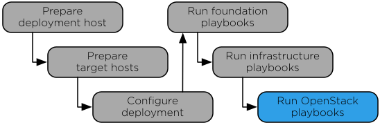

`Home <index.html>`_ OpenStack-Ansible Installation Guide

==============================
Chapter 7. OpenStack playbooks
==============================

**Figure 7.1. Installation work flow**

The ``setup-openstack.yml`` playbook installs OpenStack services and
performs the following operations:

-  Installs Identity (keystone)

-  Installs the Image service (glance)

-  Installs Block Storage (cinder)

-  Installs Compute (nova)

-  Installs Networking (neutron)

-  Installs Orchestration (heat)

-  Installs Dashboard (horizon)

-  Installs Telemetry (ceilometer and aodh)

-  Installs Object Storage (swift)

-  Installs Ironic

Running the OpenStack playbook
~~~~~~~~~~~~~~~~~~~~~~~~~~~~~~

#. Change to the ``/opt/openstack-ansible/playbooks`` directory.

#. Run the OpenStack setup playbook:

   .. code-block:: shell-session

      # openstack-ansible setup-openstack.yml

   Confirm satisfactory completion with zero items unreachable or
   failed.

Utility container
~~~~~~~~~~~~~~~~~

The utility container provides a space where miscellaneous tools and
software are installed. Tools and objects are placed in a
utility container if they do not require a dedicated container or if it
is impractical to create a new container for a single tool or object.
Utility containers are also used when tools cannot be installed
directly onto a host.

For example, the tempest playbooks are installed on the utility
container since tempest testing does not need a container of its own.

Verifying OpenStack operation
~~~~~~~~~~~~~~~~~~~~~~~~~~~~~

Verify basic operation of the OpenStack API and dashboard.

**Procedure 8.1. Verifying the API**

The utility container provides a CLI environment for additional
configuration and testing.

#. Determine the utility container name:

   .. code-block:: shell-session

      # lxc-ls | grep utility
      infra1_utility_container-161a4084

#. Access the utility container:

   .. code-block:: shell-session

      # lxc-attach -n infra1_utility_container-161a4084

#. Source the ``admin`` tenant credentials:

   .. code-block:: shell-session

      # source /root/openrc

#. Run an OpenStack command that uses one or more APIs. For example:

   .. code-block:: shell-session

      # openstack user list
      +----------------------------------+--------------------+
      | ID                               | Name               |
      +----------------------------------+--------------------+
      | 08fe5eeeae314d578bba0e47e7884f3a | alt_demo           |
      | 0aa10040555e47c09a30d2240e474467 | dispersion         |
      | 10d028f9e47b4d1c868410c977abc3df | glance             |
      | 249f9ad93c024f739a17ca30a96ff8ee | demo               |
      | 39c07b47ee8a47bc9f9214dca4435461 | swift              |
      | 3e88edbf46534173bc4fd8895fa4c364 | cinder             |
      | 41bef7daf95a4e72af0986ec0583c5f4 | neutron            |
      | 4f89276ee4304a3d825d07b5de0f4306 | admin              |
      | 943a97a249894e72887aae9976ca8a5e | nova               |
      | ab4f0be01dd04170965677e53833e3c3 | stack_domain_admin |
      | ac74be67a0564722b847f54357c10b29 | heat               |
      | b6b1d5e76bc543cda645fa8e778dff01 | ceilometer         |
      | dc001a09283a404191ff48eb41f0ffc4 | aodh               |
      | e59e4379730b41209f036bbeac51b181 | keystone           |
      +----------------------------------+--------------------+

**Procedure 8.2. Verifying the dashboard**

#. With a web browser, access the dashboard using the external load
   balancer IP address defined by the ``external_lb_vip_address`` option
   in the ``/etc/openstack_deploy/openstack_user_config.yml`` file. The
   dashboard uses HTTPS on port 443.

#. Authenticate using the username ``admin`` and password defined by the
   ``keystone_auth_admin_password`` option in the
   ``/etc/openstack_deploy/user_variables.yml`` file.

.. note::

   Only users with administrator privileges can upload public images
   using the dashboard or CLI.

--------------

.. include:: navigation.txt
