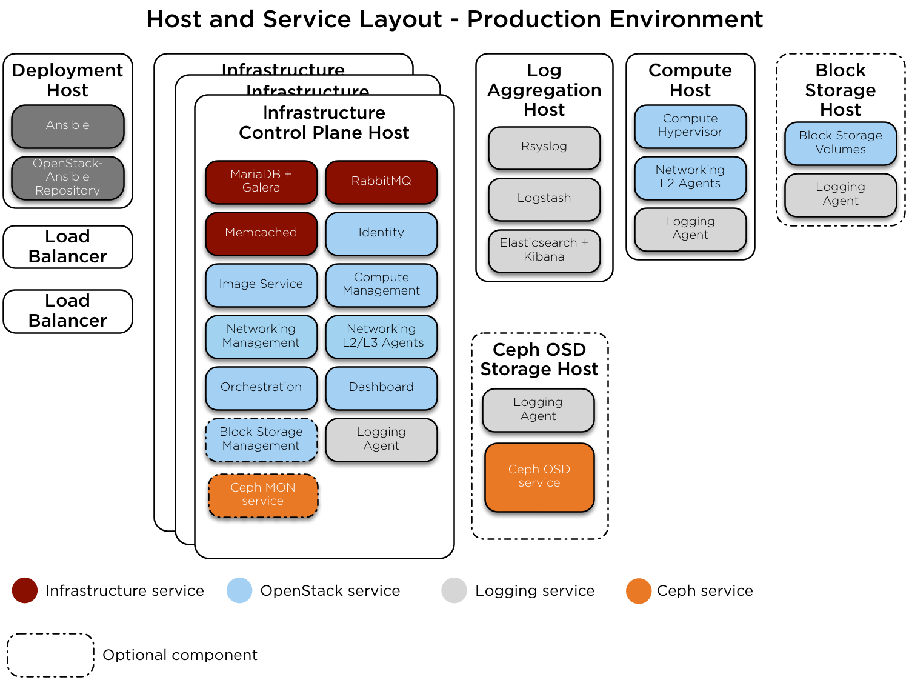

`Home <index.html>`_ OpenStack-Ansible Installation Guide

.. _host-layout:

===========
Host layout
===========

The hosts are called target hosts because Ansible deploys the OSA
environment within these hosts. We recommend a
deployment host from which Ansible orchestrates the deployment
process. One of the target hosts can function as the deployment host.

If the optional Block Storage (cinder) service is used, we recommend
using an additional host. Block Storage hosts require an LVM volume group named
``cinder-volumes``. See `the section called "Installation
requirements" <overview-requirements.html>`_ and `the section
called "Configuring LVM" <targethosts-prepare.html#configuring-lvm>`_
for more information.

Use at least one load balancer to manage the traffic among
the target hosts. You can use any type of load balancer such as a hardware
appliance or software like `HAProxy <http://www.haproxy.org/>`_. We recommend
using physical load balancers for a production environment.

A Control Plane and Infrastucture target host contains the following
services:

-  Infrastructure:

   -  Galera

   -  RabbitMQ

   -  Memcached

   -  Logging

   -  Repository

-  OpenStack:

   -  Identity (keystone)

   -  Image service (glance)

   -  Compute management (nova)

   -  Networking (neutron)

   -  Orchestration (heat)

   -  Dashboard (horizon)

Log aggregation hosts contain the following services:

-  Rsyslog

Compute target hosts contain the following services:

-  Compute virtualization

-  Logging

(Optional) Storage target hosts contain the following services:

-  Block Storage scheduler

-  Block Storage volumes

Test environment
~~~~~~~~~~~~~~~~

The test environment is a minimal set of components to deploy a working
OpenStack-ansible environment. It consists of three hosts in total: one
control plane and infrastructure host, one compute host and one storage host.
It also has the following features:

 - One Network Interface Card (NIC) for each target host
 - No log aggregation target host
 - File-backed storage for glance and nova
 - LVM-backed cinder

 .. image:: figures/arch-layout-test.png
   :width: 100%
   :alt: Test environment host layout

Production environment
~~~~~~~~~~~~~~~~~~~~~~

The layout for a production environment involves seven target
hosts in total: three control plane and infrastructure hosts, two compute
hosts, one storage host and one log aggregation host. It also has the
following features:

 - Bonded NICs
 - NFS/Ceph-backed storage for nova, glance, and cinder

All hosts will need at least one networking
interface, but we recommend multiple bonded interfaces.

For more information on physical, logical, and virtual network
interfaces within hosts see :ref:`network-architecture`.

