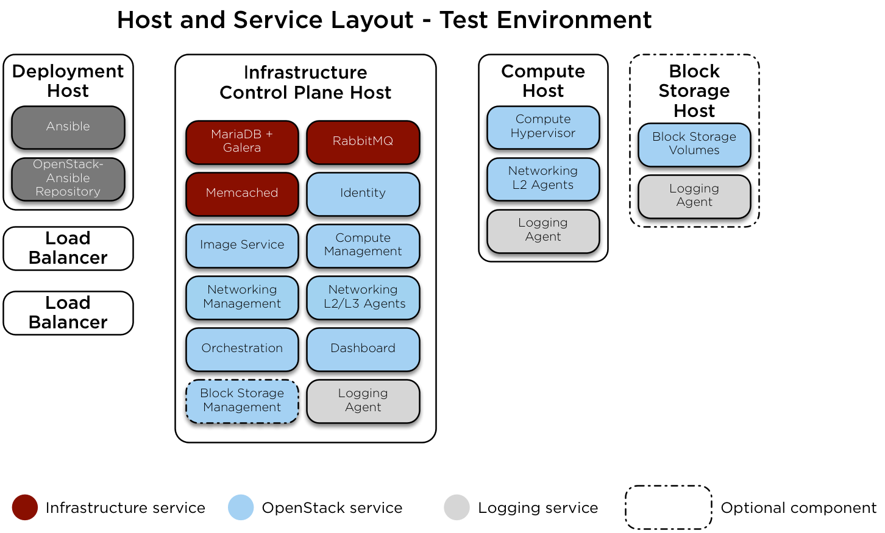

.. _host-layout:

===========
Host layout
===========

* Infrastructure:

  * Galera
  * RabbitMQ
  * Memcached
  * Repository

* (Optional) Load Balancer hosts:

  * HAProxy

    .. note::

       Use at least one load balancer to manage the traffic among
       the target hosts. You can use any type of load balancer such as a hardware
       appliance or software like `HAProxy <http://www.haproxy.org/>`_. We recommend
       using physical load balancers for a production environment.

* Log aggregation host:

  *  Rsyslog

* OpenStack API services:

  * Identity (keystone)
  * Image service (glance)
  * Compute management (nova)
  * Networking (neutron)
  * Orchestration (heat)
  * Dashboard (horizon)

* Compute hosts:

  * Compute virtualization (``nova-compute``)
  * Networking agent (``neutron-agent``)

* (Optional) Storage hosts:

  * Block Storage scheduler (``cinder-scheduler``)
  * Block Storage volumes (``cinder-volume``)

   .. note::

      If the optional Block Storage (cinder) service is used, we recommend
      using an additional host. Block Storage hosts require an LVM volume group named
      ``cinder-volumes``. See `the section called "Installation
      requirements" <overview-requirements.html>`_ and `the section
      called "Configuring LVM" <targethosts-prepare.html#configuring-lvm>`_
      for more information.

Test environment
~~~~~~~~~~~~~~~~

The test environment is a minimal set of components to deploy a working
OpenStack-Ansible environment. It consists of three hosts in total:

* One control plane and infrastructure host
* One compute host
* One storage host

It contains the following features:

* One Network Interface Card (NIC) for each target host
* No log aggregation host
* File-backed storage for glance and nova
* LVM-backed cinder

Production environment
~~~~~~~~~~~~~~~~~~~~~~

The production environment is a more complicated set of components to deploy
a working OpenStack-Ansible environment. The layout for a production
environment involves seven target hosts in total:

* Three control plane and infrastructure hosts
* Two compute hosts
* One storage host
* One log aggregation host

It contains the following features:

* Bonded NICs
* NFS/Ceph-backed storage for nova, glance, and cinder

All hosts need at least one networking
interface, but we recommend multiple bonded interfaces.

For more information on physical, logical, and virtual network
interfaces within hosts see :ref:`network-architecture`.

.. image:: figures/arch-layout-production.png
   :width: 100%
   :alt: Production environment host layout
