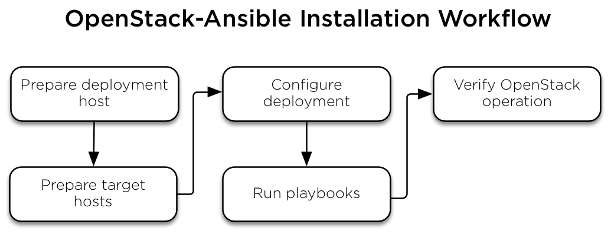

=====================
Installation workflow
=====================

This diagram shows the general workflow associated with an
OpenStack-Ansible installation.

   **Installation workflow**

#. :doc:`Prepare deployment host <deploymenthost>`
#. :doc:`Prepare target hosts <targethosts>`
#. :doc:`Configure deployment <configure>`
#. :doc:`Run playbooks <installation#run-playbooks>`
#. :doc:`Verify OpenStack operation <installation>`

-----------

.. include:: navigation.txt
