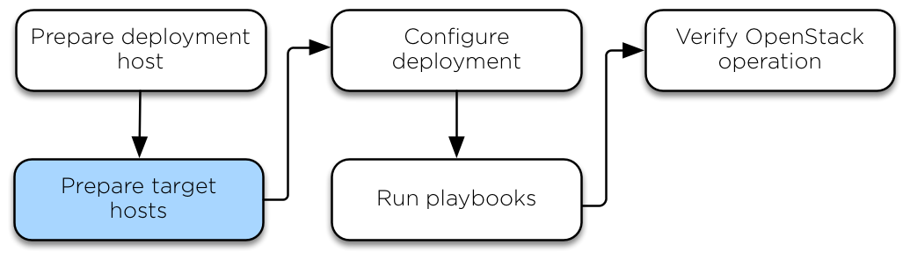

============
Target hosts
============

.. toctree::
   :maxdepth: 2

   targethosts-prepare.rst
   targethosts-networkconfig.rst

On each target host, perform the following tasks:

* Name the target hosts
* Install the operating system
* Generate and set up security measures
* Update the operating system and install additional software packages
* Create LVM volume groups
* Configure networking devices

--------------

.. include:: navigation.txt
