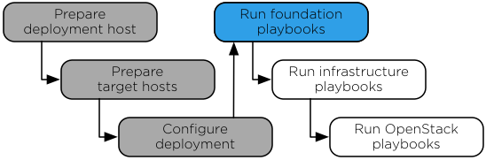

`Home <index.html>`_ OpenStack-Ansible Installation Guide

===============================
Chapter 5. Foundation playbooks
===============================

**Figure 5.1. Installation work flow**

The main Ansible foundation playbook prepares the target hosts for
infrastructure and OpenStack services and performs the following
operations:

-  Performs deployment host initial setup

-  Builds containers on target hosts

-  Restarts containers on target hosts

-  Installs common components into containers on target hosts

Running the foundation playbook
~~~~~~~~~~~~~~~~~~~~~~~~~~~~~~~

.. note::

   Before continuing, validate the configuration files using the
   guidance in `Checking the integrity of your configuration files`_.

   .. _Checking the integrity of your configuration files: ../install-guide/configure-configurationintegrity.html

#. Change to the ``/opt/openstack-ansible/playbooks`` directory.

#. Run the host setup playbook:

   .. code-block:: shell-session

       # openstack-ansible setup-hosts.yml

   Confirm satisfactory completion with zero items unreachable or
   failed:

   .. code-block:: shell-session

       PLAY RECAP ********************************************************************
       ...
       deployment_host                :  ok=18   changed=11   unreachable=0    failed=0

#. If using HAProxy:

   .. note::

     To run HAProxy on multiple hosts, use ``keepalived`` to make HAProxy highly
     available. The keepalived role downloads during the ``bootstrap-ansible`` stage.
     If not, re-run the following command before running the HAProxy playbook:

     .. code-block:: shell-session

        # pushd /opt/openstack-ansible; scripts/bootstrap-ansible.sh; popd

     or

     .. code-block:: shell-session

        # ansible-galaxy install -r ../ansible-role-requirements.yml

  Run the playbook to deploy HAProxy:

  .. code-block:: shell-session

     # openstack-ansible haproxy-install.yml

--------------

.. include:: navigation.txt
