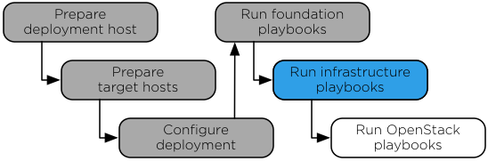

`Home <index.html>`_ OpenStack-Ansible Installation Guide

===================================
Chapter 6. Infrastructure playbooks
===================================

**Figure 6.1. Installation workflow**

The main Ansible infrastructure playbook installs infrastructure
services and performs the following operations:

-  Installs Memcached

-  Installs the repository server

-  Installs Galera

-  Installs RabbitMQ

-  Installs Rsyslog

-  Configures Rsyslog

Running the infrastructure playbook
~~~~~~~~~~~~~~~~~~~~~~~~~~~~~~~~~~~

.. note::

   Before continuing, validate the configuration files using the
   guidance in `Checking the integrity of your configuration files`_.

.. _Checking the integrity of your configuration files: ../install-guide/configure-configurationintegrity.html

#. Change to the ``/opt/openstack-ansible/playbooks`` directory.

#. Run the infrastructure setup playbook:

   .. code-block:: shell-session

      # openstack-ansible setup-infrastructure.yml

   Confirm satisfactory completion with zero items unreachable or
   failed:

   .. code-block:: shell-session

      PLAY RECAP ********************************************************************
      ...
      deployment_host                : ok=27   changed=0    unreachable=0    failed=0

Verify the database cluster
~~~~~~~~~~~~~~~~~~~~~~~~~~~

#. Change to the ``/opt/openstack-ansible/playbooks`` directory.

#. Execute the following command to show the current cluster state:

   .. code-block:: shell-session

      # ansible galera_container -m shell -a "mysql \
      -h localhost -e 'show status like \"%wsrep_cluster_%\";'"

   Example output:

   .. code-block:: shell-session

      node3_galera_container-3ea2cbd3 | success | rc=0 >>
      Variable_name             Value
      wsrep_cluster_conf_id     17
      wsrep_cluster_size        3
      wsrep_cluster_state_uuid  338b06b0-2948-11e4-9d06-bef42f6c52f1
      wsrep_cluster_status      Primary

      node2_galera_container-49a47d25 | success | rc=0 >>
      Variable_name             Value
      wsrep_cluster_conf_id     17
      wsrep_cluster_size        3
      wsrep_cluster_state_uuid  338b06b0-2948-11e4-9d06-bef42f6c52f1
      wsrep_cluster_status      Primary

      node4_galera_container-76275635 | success | rc=0 >>
      Variable_name             Value
      wsrep_cluster_conf_id     17
      wsrep_cluster_size        3
      wsrep_cluster_state_uuid  338b06b0-2948-11e4-9d06-bef42f6c52f1
      wsrep_cluster_status      Primary

   The ``wsrep_cluster_size`` field indicates the number of nodes
   in the cluster and the ``wsrep_cluster_status`` field indicates
   primary.

--------------

.. include:: navigation.txt
