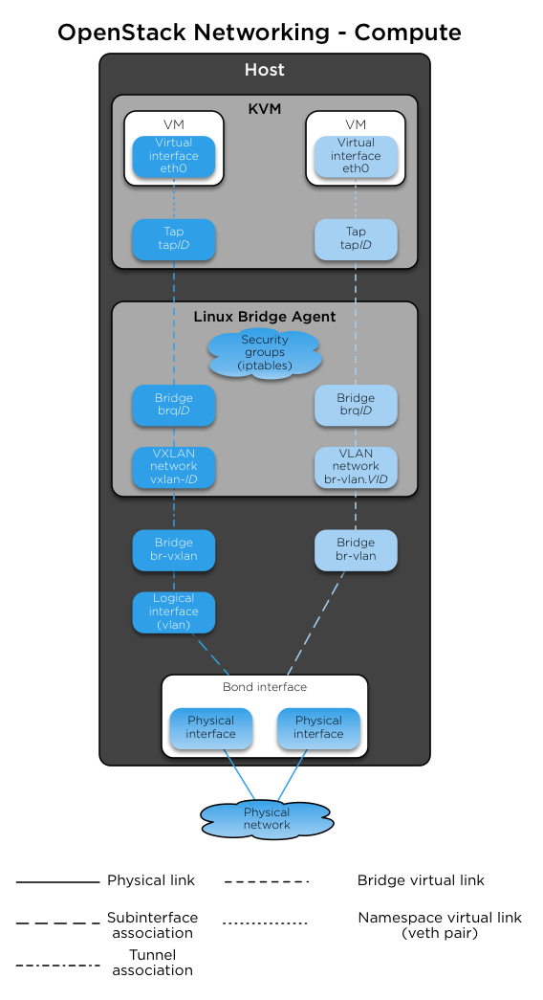
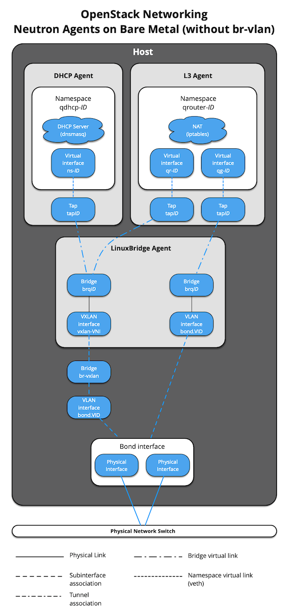
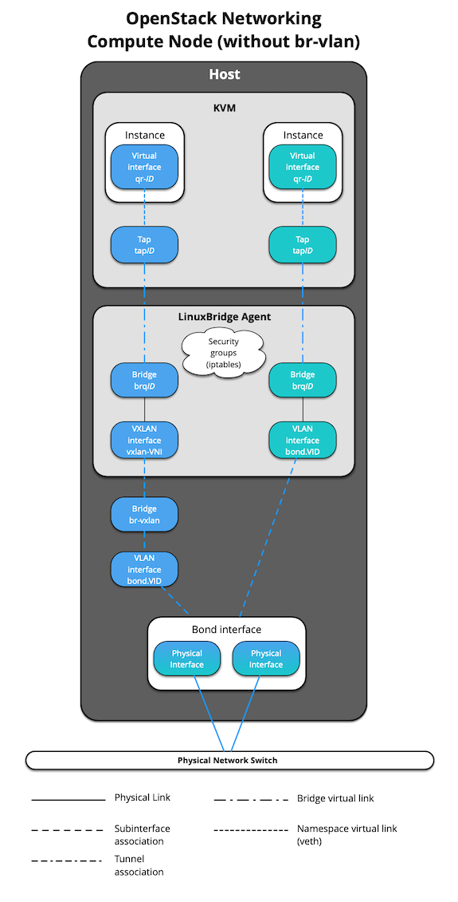

.. _container-networking:

Container networking
====================

OpenStack-Ansible deploys Linux containers (LXC) and uses Linux
bridging between the container and the host interfaces to ensure that
all traffic from containers flows over multiple host interfaces. This appendix
describes how the interfaces are connected and how traffic flows.

For more information about how the OpenStack Networking service (neutron) uses
the interfaces for instance traffic, please see the
`OpenStack Networking Guide`_.

.. _OpenStack Networking Guide: https://docs.openstack.org/neutron/latest/admin/index.html

For details on the configuration of networking for your
environment, please have a look at :ref:`openstack-user-config-reference`.

Physical host interfaces
~~~~~~~~~~~~~~~~~~~~~~~~

In a typical production environment, physical network interfaces are combined
in bonded pairs for better redundancy and throughput. Avoid using two ports on
the same multiport network card for the same bonded interface, because a
network card failure affects both of the physical network interfaces used by
the bond.

Linux bridges
~~~~~~~~~~~~~

The combination of containers and flexible deployment options requires
implementation of advanced Linux networking features, such as bridges and
namespaces.

* Bridges provide layer 2 connectivity (similar to switches) among
  physical, logical, and virtual network interfaces within a host. After
  a bridge is created, the network interfaces are virtually plugged in to
  it.

  OpenStack-Ansible uses bridges to connect physical and logical network
  interfaces on the host to virtual network interfaces within containers.

* Namespaces provide logically separate layer 3 environments (similar to
  routers) within a host. Namespaces use virtual interfaces to connect
  with other namespaces, including the host namespace. These interfaces,
  often called ``veth`` pairs, are virtually plugged in between
  namespaces similar to patch cables connecting physical devices such as
  switches and routers.

  Each container has a namespace that connects to the host namespace with
  one or more ``veth`` pairs. Unless specified, the system generates
  random names for ``veth`` pairs.

The following image demonstrates how the container network interfaces are
connected to the host's bridges and physical network interfaces:

.. image:: ../figures/networkcomponents.png

Network diagrams
~~~~~~~~~~~~~~~~

Hosts with services running in containers
-----------------------------------------

The following diagram shows how all of the interfaces and bridges interconnect
to provide network connectivity to the OpenStack deployment:

.. image:: ../figures/networkarch-container-external.png

The interface ``lxcbr0`` provides connectivity for the containers to the
outside world, thanks to dnsmasq (dhcp/dns) + NAT.

.. note::

   If you require additional network configuration for your container interfaces
   (like changing the routes on eth1 for routes on the management network),
   please adapt your ``openstack_user_config.yml`` file.
   See :ref:`openstack-user-config-reference` for more details.

Services running "on metal" (deploying directly on the physical hosts)
----------------------------------------------------------------------

OpenStack-Ansible deploys the Compute service on the physical host rather than
in a container. The following diagram shows how to use bridges for
network connectivity:

.. image:: ../figures/networkarch-bare-external.png

Neutron traffic
---------------

The following diagram shows how the Networking service (neutron) agents
work with the ``br-vlan`` and ``br-vxlan`` bridges. Neutron is configured to
use a DHCP agent, an L3 agent, and a Linux Bridge agent within a
networking-agents container. The diagram shows how DHCP agents provide
information (IP addresses and DNS servers) to the instances, and how routing
works on the image.

.. image:: ../figures/networking-neutronagents.png

The following diagram shows how virtual machines connect to the ``br-vlan`` and
``br-vxlan`` bridges and send traffic to the network outside the host:

When Neutron agents are deployed "on metal" on a network node or collapsed
infra/network node, the ``Neutron Agents`` container and respective virtual
interfaces are no longer implemented. In addition, use of the
``host_bind_override`` override when defining provider networks allows
Neutron to interface directly with a physical interface or bond instead of the
``br-vlan`` bridge. The following diagram reflects the differences in the
virtual network layout.

The absence of ``br-vlan`` in-path of instance traffic is also reflected on
compute nodes, as shown in the following diagram.

