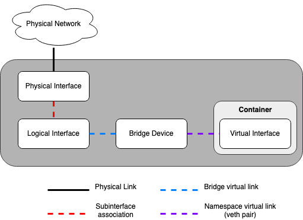
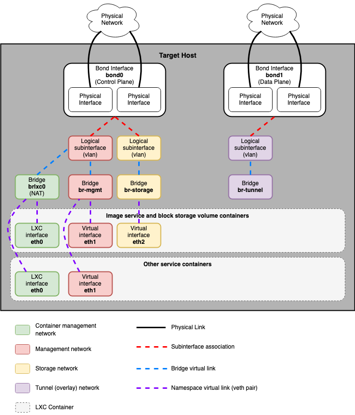
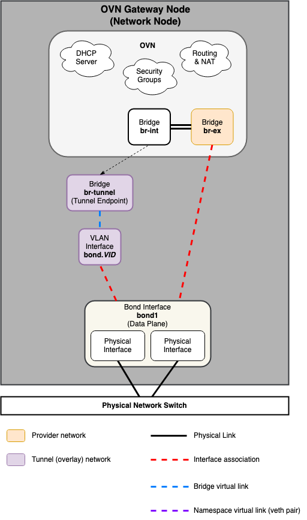
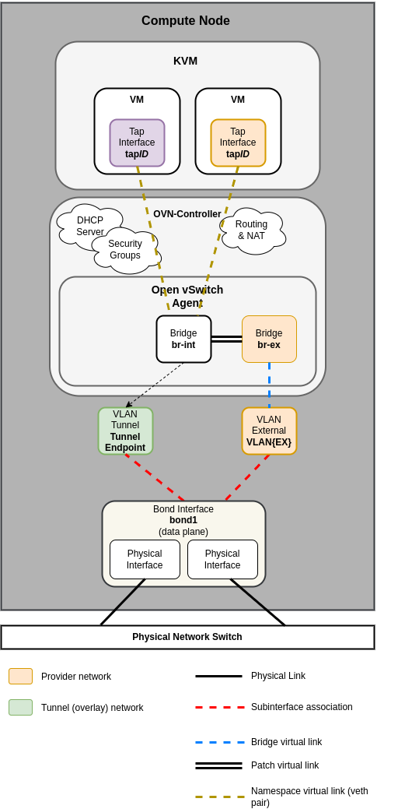
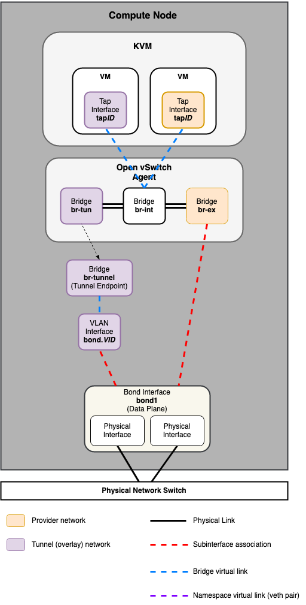

.. _container-networking:

Container networking
====================

OpenStack-Ansible deploys Linux containers (LXC) and uses Linux or Open
vSwitch-based bridging between the container and the host interfaces to ensure
that all traffic from containers flows over multiple host interfaces. All
services in this deployment model use a *unique* IP address.

This appendix describes how the interfaces are connected and how traffic flows.

For more information about how the OpenStack Networking service (Neutron) uses
the interfaces for instance traffic, please see the
`OpenStack Networking Guide`_.

.. _OpenStack Networking Guide: https://docs.openstack.org/neutron/latest/admin/index.html

For details on the configuration of networking for your
environment, please have a look at :ref:`openstack-user-config-reference`.

Physical host interfaces
~~~~~~~~~~~~~~~~~~~~~~~~

In a typical production environment, physical network interfaces are combined
in bonded pairs for better redundancy and throughput. Avoid using two ports on
the same multiport network card for the same bonded interface, because a
network card failure affects both of the physical network interfaces used by
the bond. Single (bonded) interfaces are also a supported configuration, but
will require the use of VLAN subinterfaces.

Linux Bridges/Switches
~~~~~~~~~~~~~~~~~~~~~~

The combination of containers and flexible deployment options requires
implementation of advanced Linux networking features, such as bridges,
switches, and namespaces.

* Bridges provide layer 2 connectivity (similar to physical switches) among
  physical, logical, and virtual network interfaces within a host. After
  a bridge/switch is created, the network interfaces are virtually plugged
  in to it.

  OpenStack-Ansible uses Linux bridges for control plane connections to LXC
  containers, and can use Linux bridges or Open vSwitch-based bridges for
  data plane connections that connect virtual machine instances to the
  physical network infrastructure.

* Network namespaces provide logically separate layer 3 environments (similar
  to VRFs) within a host. Namespaces use virtual interfaces to connect
  with other namespaces, including the host namespace. These interfaces,
  often called ``veth`` pairs, are virtually plugged in between
  namespaces similar to patch cables connecting physical devices such as
  switches and routers.

  Each container has a namespace that connects to the host namespace with
  one or more ``veth`` pairs. Unless specified, the system generates
  random names for ``veth`` pairs.

The following image demonstrates how the container network interfaces are
connected to the host's bridges and physical network interfaces:

Network diagrams
~~~~~~~~~~~~~~~~

Hosts with services running in containers
-----------------------------------------

The following diagram shows how all of the interfaces and bridges interconnect
to provide network connectivity to the OpenStack deployment:

The bridge ``lxcbr0`` is configured automatically and provides
connectivity for the containers (via eth0) to the outside world, thanks to
dnsmasq (dhcp/dns) + NAT.

.. note::

   If you require additional network configuration for your container interfaces
   (like changing the routes on eth1 for routes on the management network),
   please adapt your ``openstack_user_config.yml`` file.
   See :ref:`openstack-user-config-reference` for more details.

Neutron traffic
---------------

Common reference drivers, including ML2/OVS, and ML2/OVN, and their
respective agents, are responsible for managing the virtual networking
infrastructure on each node. OpenStack-Ansible refers to Neutron traffic
as "data plane" traffic, and can consist of flat, VLAN, or overlay technologies
such as VXLAN and Geneve.

Neutron agents can be deployed across a variety of hosts, but are typically
limited to dedicated network hosts or infrastructure hosts (controller nodes).
Neutron agents are deployed "on metal" and not within an LXC container. Neutron
typically requires the operator to define "provider bridge mappings", which map
a provider network name to a physical interface. These provider bridge mappings
provide flexibility and abstract physical interface names when creating provider
networks.

Open vSwitch/OVN Example:

.. code-block:: ini

    bridge_mappings = physnet1:br-ex

OpenStack-Ansible provides two overrides when defining provider networks that
can be used for creating the mappings and in some cases, connecting the physical
interfaces to provider bridges:

- ``host_bind_override``
- ``network_interface``

The ``host_bind_override`` key is used to replace an LXC-related interface
name with a physical interface name when a component is deployed on bare metal hosts.
It will be used to populate ``network_mappings`` for Neutron.

The ``network_interface`` override is used for Open vSwitch and OVN-based deployments,
and requires a physical interface name which will be connected to the provider bridge
(ie. br-ex) for flat and vlan-based provider and tenant network traffic.

.. note::

    Previous versions of OpenStack-Ansible utilized a bridge named ``br-vlan`` for
    flat and vlan-based provider and tenant network traffic. The ``br-vlan`` bridge
    is a leftover of containerized Neutron agents and is no longer useful or
    recommended.

The following diagrams reflect the differences in the virtual network layout for
supported network architectures.

Open Virtual Network (OVN)
..........................

.. note::

   The ML2/OVN mechanism driver is deployed by default
   as of the Zed release of OpenStack-Ansible.

Networking Node
***************

Compute Node
************

Open vSwitch (OVS)
..................

Networking Node
***************

.. image:: ../figures/networking-openvswitch-nn.drawio.png
   :align: center

Compute Node
************

