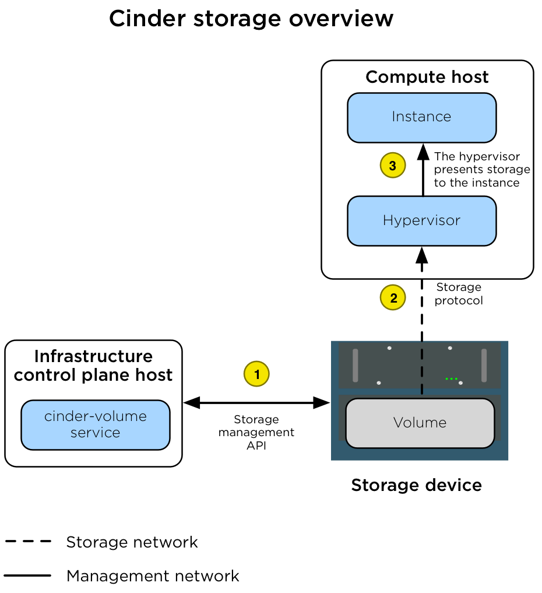
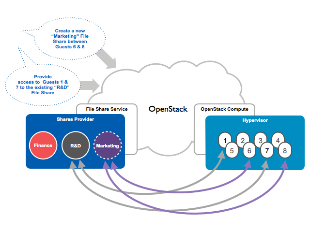

Storage architecture
====================

OpenStack has multiple storage realms to consider:

* Block Storage (cinder)
* Object Storage (swift)
* Image storage (glance)
* Ephemeral storage (nova)
* Filesystem storage (manila)

Block Storage (cinder)
~~~~~~~~~~~~~~~~~~~~~~

The Block Storage (cinder) service manages volumes on storage devices in an
environment. In a production environment, the device presents storage via a
storage protocol (for example, NFS, iSCSI, or Ceph RBD) to a storage network
(``br-storage``) and a storage management API to the
management network (``br-mgmt``). Instances are connected to the volumes via
the storage network by the hypervisor on the Compute host.

The following diagram illustrates how Block Storage is connected to instances.

   The diagram shows the following steps.

   +----+---------------------------------------------------------------------+
   | 1. | A volume is created by the assigned ``cinder-volume`` service       |
   |    | using the appropriate `cinder driver`_. The volume is created by    |
   |    | using an API that is presented to the management network.           |
   +----+---------------------------------------------------------------------+
   | 2. | After the volume is created, the ``nova-compute`` service connects  |
   |    | the Compute host hypervisor to the volume via the storage network.  |
   +----+---------------------------------------------------------------------+
   | 3. | After the hypervisor is connected to the volume, it presents the    |
   |    | volume as a local hardware device to the instance.                  |
   +----+---------------------------------------------------------------------+

.. important::

   The `LVMVolumeDriver`_ is designed as a reference driver implementation,
   which we do not recommend for production usage. The LVM storage back-end
   is a single-server solution that provides no high-availability options.
   If the server becomes unavailable, then all volumes managed by the
   ``cinder-volume`` service running on that server become unavailable.
   Upgrading the operating system packages (for example,  kernel or iSCSI)
   on the server causes storage connectivity outages because the iSCSI service
   (or the host) restarts.

Because of a `limitation with container iSCSI connectivity`_, you must deploy
the ``cinder-volume`` service directly on a physical host (not into a
container) when using storage back ends that connect via iSCSI. This includes
the `LVMVolumeDriver`_ and many of the drivers for commercial storage devices.

.. note::

    The ``cinder-volume`` service does not run in a highly available
    configuration. When the ``cinder-volume`` service is configured to manage
    volumes on the same back end from multiple hosts or containers, one service
    is scheduled to manage the life cycle of the volume until an alternative
    service is assigned to do so. This assignment can be made through the
    `cinder-manage CLI tool`_. This configuration might change if
    `cinder volume active-active support spec`_ is implemented.

.. _cinder driver: http://docs.openstack.org/developer/cinder/drivers.html
.. _LVMVolumeDriver: http://docs.openstack.org/developer/cinder/drivers.html#lvmvolumedriver
.. _limitation with container iSCSI connectivity: https://bugs.launchpad.net/ubuntu/+source/lxc/+bug/1226855
.. _cinder-manage CLI tool: http://docs.openstack.org/developer/cinder/man/cinder-manage.html#cinder-volume
.. _cinder volume active-active support spec: https://specs.openstack.org/openstack/cinder-specs/specs/mitaka/cinder-volume-active-active-support.html

Object Storage (swift)
~~~~~~~~~~~~~~~~~~~~~~

The Object Storage (swift) service implements a highly available, distributed,
eventually consistent object/blob store that is accessible via HTTP/HTTPS.

The following diagram illustrates how data is accessed and replicated.

.. figure:: ../figures/production-storage-swift.png
   :width: 600px

   The ``swift-proxy`` service is accessed by clients via the load balancer
   on the management network (``br-mgmt``). The ``swift-proxy`` service
   communicates with the Account, Container, and Object services on the
   Object Storage hosts via the storage network(``br-storage``). Replication
   between the Object Storage hosts is done via the replication network
   (``br-repl``).

Image storage (glance)
~~~~~~~~~~~~~~~~~~~~~~

The Image service (glance) can be configured to store images on a variety of
storage back ends supported by the `glance_store drivers`_.

.. important::

   When the File System store is used, the Image service has no mechanism of
   its own to replicate the image between Image service hosts. We recommend
   using a shared storage back end (via a file system mount) to ensure that
   all ``glance-api`` services have access to all images. Doing so prevents
   losing access to images when an infrastructure (control plane) host is lost.

The following diagram illustrates the interactions between the Image service,
the storage device, and the ``nova-compute`` service when an instance is
created.

.. figure:: ../figures/production-storage-glance.png
   :width: 600px

   The diagram shows the following steps.

   +----+---------------------------------------------------------------------+
   | 1  | When a client requests an image, the ``glance-api`` service         |
   |    | accesses the appropriate store on the storage device over the       |
   |    | storage network (``br-storage``) and pulls it into its cache. When  |
   |    | the same image is requested again, it is given to the client        |
   |    | directly from the cache.                                            |
   +----+---------------------------------------------------------------------+
   | 2  | When an instance is scheduled for creation on a Compute host, the   |
   |    | ``nova-compute`` service requests the image from the ``glance-api`` |
   |    | service over the management network (``br-mgmt``).                  |
   +----+---------------------------------------------------------------------+
   | 3  | After the image is retrieved, the ``nova-compute`` service stores   |
   |    | the image in its own image cache. When another instance is created  |
   |    | with the same image, the image is retrieved from the local base     |
   |    | image cache.                                                        |
   +----+---------------------------------------------------------------------+

.. _glance_store drivers: http://docs.openstack.org/developer/glance_store/drivers/

Ephemeral storage (nova)
~~~~~~~~~~~~~~~~~~~~~~~~

When the flavors in the Compute service are configured to provide instances
with root or ephemeral disks, the ``nova-compute`` service manages these
allocations using its ephemeral disk storage location.

In many environments, the ephemeral disks are stored on the Compute host's
local disks, but for production environments we recommend that the Compute
hosts be configured to use a shared storage subsystem instead. A shared
storage subsystem allows quick, live instance migration between Compute hosts,
which is useful when the administrator needs to perform maintenance on the
Compute host and wants to evacuate it. Using a shared storage subsystem also
allows the recovery of instances when a Compute host goes offline. The
administrator is able to evacuate the instance to another Compute host and
boot it up again. The following diagram illustrates the interactions between
the storage device, the Compute host, the hypervisor, and the instance.

.. figure:: ../figures/production-storage-nova.png
   :width: 600px

   The diagram shows the following steps.

   +----+---------------------------------------------------------------------+
   | 1  | The Compute host is configured with access to the storage device.   |
   |    | The Compute host accesses the storage space via the storage network |
   |    | (``br-storage``) by using a storage protocol (for example, NFS,     |
   |    | iSCSI, or Ceph RBD).                                                |
   +----+---------------------------------------------------------------------+
   | 2  | The ``nova-compute`` service configures the hypervisor to present   |
   |    | the allocated instance disk as a device to the instance.            |
   +----+---------------------------------------------------------------------+
   | 3  | The hypervisor presents the disk as a device to the instance.       |
   +----+---------------------------------------------------------------------+

Filesystem storage (manila)
~~~~~~~~~~~~~~~~~~~~~~~~~~~

The shared filesystem service (manila) can be configured to provide file
systems on a variety of storage back ends as supported by the
`manila_store drivers`_.

   The diagram shows a basic overview of the manila service.

.. _manila_store drivers: https://docs.openstack.org/manila/latest/configuration/shared-file-systems/drivers.html
