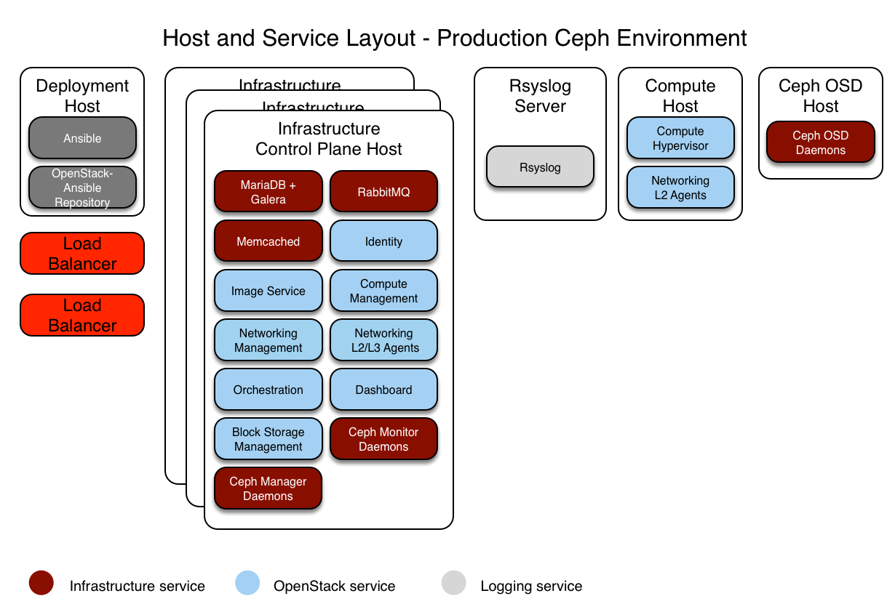

.. _production-ceph-environment-config:

=======================
Ceph production example
=======================

This section describes an example production environment for a working
OpenStack-Ansible (OSA) deployment with high availability services and using
the Ceph backend for images, volumes, and instances.

This example environment has the following characteristics:

* Three infrastructure (control plane) hosts with ceph-mon containers
* Two compute hosts
* Three Ceph OSD storage hosts
* One log aggregation host
* Multiple Network Interface Cards (NIC) configured as bonded pairs for each
  host
* Full compute kit with the Telemetry service (ceilometer) included,
  with Ceph configured as a storage back end for the Image (glance), and Block
  Storage (cinder) services
* Internet access via the router address 172.29.236.1 on the
  Management Network

Integration with Ceph
~~~~~~~~~~~~~~~~~~~~~

OpenStack-Ansible allows `Ceph storage <https://ceph.io>`_ cluster
integration in three ways:

* connecting to your own pre-deployed ceph cluster by pointing to its
  information in ``user_variables.yml`` and allowing OpenStack-Ansible
  to ssh to the ceph monitors to retrieve the contents of ceph.conf
  and the keyrings.

  This method only requires a very small amount of configuration
  in ``user_variables.yml`` to point to the external ceph cluster monitors.
  The whole configuration for ceph-ansible would live outside the
  OpenStack-Ansible deployment and there is no duplication.
  The ``ceph_mons`` variable expects a list of IP addresses for the
  Ceph Monitor servers in the external ceph deployment:

.. note::

  Overriding ceph_mons is required only when you are using external
  cluster which does not present in the OpenStack-Ansible's inventory
  (ie group ``mon_group_name`` is not defined).

.. code-block:: yaml

  ceph_mons:
      - 172.29.244.151
      - 172.29.244.152
      - 172.29.244.153

* connecting to your own pre-deployed ceph cluster by pointing to its
  monitors in ``user_variables.yml`` as above and providing data to
  populate ceph.conf and ceph keyring files on the deploy host.
  This is described `here <https://docs.openstack.org/openstack-ansible-ceph_client/latest/config-from-file.html>`_.
  No ssh access by OpenStack-Ansible is required to the ceph cluster.
* deploying a ceph cluster as part of the OpenStack-Ansible deployment
  by using the roles maintained by the `Ceph-Ansible`_ project. Deployers
  can enable the ``ceph-install.yml`` playbook by adding hosts to the
  ``ceph-mon_hosts`` and ``ceph-osd_hosts`` groups in
  ``openstack_user_config.yml``. In order to enable ``ceph-rgw-install.yml``
  playbook you need to add ``ceph-rgw_hosts`` in ``openstack_user_config.yml``.

.. note::

  Please mention, that RGW installation should be performed after deployment of
  Keystone service.

  Once groups are defined, you can proceed with configuring `Ceph-Ansible specific vars
  <https://github.com/ceph/ceph-ansible/blob/master/group_vars/all.yml.sample>`_
  in the OpenStack-Ansible ``user_variables.yml`` file.

.. warning::

  Deploying ceph cluster as part of OpenStack-Ansible is not recommended since
  ceph-ansible upgrade path is not tested or supported. This option is mainly
  used for CI and AIO deployments to test and demonstrate a sample integration
  of the software stack.

.. _Ceph-Ansible: https://github.com/ceph/ceph-ansible/

This example will focus on the deployment of both OpenStack-Ansible
and its Ceph cluster.

Network configuration
~~~~~~~~~~~~~~~~~~~~~

Network CIDR/VLAN assignments
-----------------------------

The following CIDR and VLAN assignments are used for this environment.

+-----------------------+-----------------+------+
| Network               | CIDR            | VLAN |
+=======================+=================+======+
| Management Network    | 172.29.236.0/22 |  10  |
+-----------------------+-----------------+------+
| Tunnel (VXLAN) Network| 172.29.240.0/22 |  30  |
+-----------------------+-----------------+------+
| Storage Network       | 172.29.244.0/22 |  20  |
+-----------------------+-----------------+------+

IP assignments
--------------

The following host name and IP address assignments are used for this
environment.

+------------------+----------------+-------------------+----------------+
| Host name        | Management IP  | Tunnel (VxLAN) IP | Storage IP     |
+==================+================+===================+================+
| lb_vip_address   | 172.29.236.9   |                   |                |
+------------------+----------------+-------------------+----------------+
| infra1           | 172.29.236.11  | 172.29.240.11     |                |
+------------------+----------------+-------------------+----------------+
| infra2           | 172.29.236.12  | 172.29.240.12     |                |
+------------------+----------------+-------------------+----------------+
| infra3           | 172.29.236.13  | 172.29.240.13     |                |
+------------------+----------------+-------------------+----------------+
| log1             | 172.29.236.14  |                   |                |
+------------------+----------------+-------------------+----------------+
| compute1         | 172.29.236.16  | 172.29.240.16     | 172.29.244.16  |
+------------------+----------------+-------------------+----------------+
| compute2         | 172.29.236.17  | 172.29.240.17     | 172.29.244.17  |
+------------------+----------------+-------------------+----------------+
| osd1             | 172.29.236.18  |                   | 172.29.244.18  |
+------------------+----------------+-------------------+----------------+
| osd2             | 172.29.236.19  |                   | 172.29.244.19  |
+------------------+----------------+-------------------+----------------+
| osd3             | 172.29.236.20  |                   | 172.29.244.20  |
+------------------+----------------+-------------------+----------------+

Host network configuration
--------------------------

Each host will require the correct network bridges to be implemented. The
following is the ``/etc/network/interfaces`` file for ``infra1``.

.. note::

   If your environment does not have ``eth0``, but instead has ``p1p1`` or
   some other interface name, ensure that all references to ``eth0`` in all
   configuration files are replaced with the appropriate name. The same
   applies to additional network interfaces.

.. literalinclude:: ../../../../etc/network/interfaces.d/openstack_interface.cfg.prod.example

Deployment configuration
~~~~~~~~~~~~~~~~~~~~~~~~

Environment layout
------------------

The ``/etc/openstack_deploy/openstack_user_config.yml`` file defines the
environment layout.

The following configuration describes the layout for this environment.

.. literalinclude:: ../../../../etc/openstack_deploy/openstack_user_config.yml.prod-ceph.example

Environment customizations
--------------------------

The optionally deployed files in ``/etc/openstack_deploy/env.d`` allow the
customization of Ansible groups. This allows the deployer to set whether
the services will run in a container (the default), or on the host (on
metal).

For a ceph environment, you can run the ``cinder-volume`` in a container.
To do this you will need to create a
``/etc/openstack_deploy/env.d/cinder.yml`` file with the following
content:

.. literalinclude:: ../../../../etc/openstack_deploy/env.d/cinder-volume.yml.container.example

User variables
--------------

The ``/etc/openstack_deploy/user_variables.yml`` file defines the global
overrides for the default variables.

For this example environment, we configure a HA load balancer.
We implement the load balancer (HAProxy) with an HA layer (Keepalived)
on the infrastructure hosts.
Your ``/etc/openstack_deploy/user_variables.yml`` must have the
following content to configure HAProxy, Keepalived and Ceph:

.. literalinclude:: ../../../../etc/openstack_deploy/user_variables.yml.prod-ceph.example
