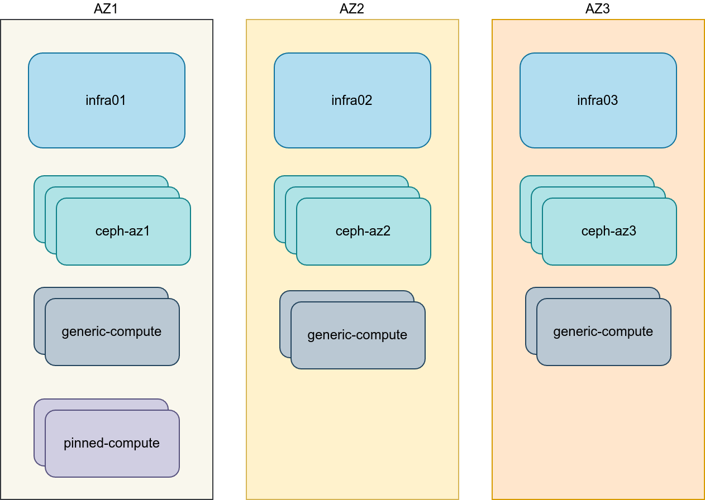
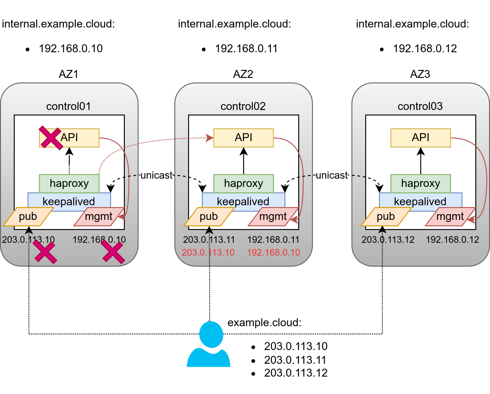

.. _az-environment-config:

=============================================
Example of multi-AZ environment configuration
=============================================

On this page, we will provide an example configuration that can be used in
production environments with multiple Availability Zones.

It will be an extended and more specific version of :ref:`pod-environment-config`
so it is expected that you are aware of the concepts and approaches defined there.

To better understand why some configuration options were applied in examples
it is also recommended to look through :ref:`configuring-inventory`

Generic design
==============

The following design decisions were made in the example below:

* Three Availability Zones (AZs)
* Three infrastructure (control plane) hosts, each host is placed in a
  different Availability Zone
* Eight compute hosts, 2 compute hosts in each Availability Zone. First
  Availability Zone has two extra compute hosts for pinned CPU aggregate.
* Three Ceph storage clusters provisioned with Ceph Ansible.
* Compute hosts act as OVN gateway hosts
* Tunnel networks which are reachable between Availability Zones
* Public API, OpenStack external and management networks are represented as
  stretched L2 networks between Availability Zones.

Load Balancing
==============

A Load Balancer (HAProxy) is usually deployed on infrastructure hosts. With
infrastructure hosts being spread across Availability Zones we need to
come up with a more complex design which is aimed at solving the following issues:

* Withstand a single Availability Zone failure
* Reduce amount of cross-AZ traffic
* Spread load across Availability Zones

To address these challenges, the following changes to the basic design were made:

* Leverage DNS Round Robin (an A/AAAA record per AZ) for Public API
* Define Internal API FQDN through /etc/hosts overrides, which are unique per
  Availability Zone
* Define 6 keepalived instances: 3 for public and 3 for internal VIPs
* Ensure HAProxy to prioritize a backend from own Availability Zone over
  "remote" ones

The example also deploys HAProxy with Keepalived in their own LXC
containers on the contrary to a more conventional bare metal deployment.
You can check a :ref:`haproxy-in-lxc` for more details on how to do that.

Storage design complications
============================

There are multiple complications related to organizing storage where the storage is not stretched between Availability Zones.

First, there is only a single controller in any given Availability
Zone, while multiple copies of ``cinder_volume`` needs to be run for
each storage provider for High Availability. As ``cinder_volume`` needs
access to storage network, one of the best places for it are ``ceph-mon``
hosts.

Another challenge is to organize shared storage for Glance Images, as
``rbd`` can't be used consistently anymore. While Glance Interoperable Import
interface could be leveraged for syncing images between ``rbd`` backends, in
fact not all clients and services can work with Glances `import API <https://docs.openstack.org/api-ref/image/v2/#interoperable-image-import>`_.
One of the most obvious solutions here can be usage of Swift API, while
configuring Ceph RadosGW policy to replicate the bucket between independent
instances located in their Availability Zones.

Last, but not the least complication is Nova scheduling when ``cross_az_attach``
is disabled. As Nova will not add an Availability Zone to instances
``request_specs`` when an instance is created from a volume directly, on the
contrary to creating volume manually in advance and supplying volume UUID to
the instance create API call. The problem with that behavior, is that Nova
will attempt to Live Migrate or re-schedule instances without an Availability
Zone in ``request_specs`` to other AZs, which will result in failure, as
``cross_az_attach`` is disabled. You can read more about this in a
Nova `bug report <https://bugs.launchpad.net/nova/+bug/2047182>`_
In order to work around this Bug you need to set a ``default_schedule_zone``
for Nova and Cinder, which will ensure AZ always being defined in
``request_specs``. You can also go further and define an actual
Availability Zone as ``default_schedule_zone``, making each controller
to have its own default. As Load Balancer will attempt to send requests
only to "local" backends first, this approach does work to distribute
new VMs across all AZs when user does not supply AZ explicitly.
Otherwise, the "default" AZ will be accepting significantly more
new signups.

Configuration examples
======================

Network configuration
~~~~~~~~~~~~~~~~~~~~~

Network CIDR/VLAN assignments
-----------------------------

The following CIDR assignments are used for this environment.

+-----------------------------+-----------------+------+
| Network                     | CIDR            | VLAN |
+=============================+=================+======+
| Management Network          | 172.29.236.0/22 |  10  |
+-----------------------------+-----------------+------+
| AZ1 Storage Network         | 172.29.244.0/24 |  20  |
+-----------------------------+-----------------+------+
| AZ1 Tunnel (Geneve) Network | 172.29.240.0/24 |  30  |
+-----------------------------+-----------------+------+
| AZ2 Storage Network         | 172.29.245.0/24 |  21  |
+-----------------------------+-----------------+------+
| AZ2 Tunnel (Geneve) Network | 172.29.241.0/24 |  31  |
+-----------------------------+-----------------+------+
| AZ3 Storage Network         | 172.29.246.0/24 |  22  |
+-----------------------------+-----------------+------+
| AZ3 Tunnel (Geneve) Network | 172.29.242.0/24 |  32  |
+-----------------------------+-----------------+------+
| Public API VIPs             | 203.0.113.0/28  |  400 |
+-----------------------------+-----------------+------+

IP assignments
--------------

The following host name and IP address assignments are used for this
environment.

+------------------+----------------+--------------------+----------------+
| Host name        | Management IP  | Tunnel (Geneve) IP | Storage IP     |
+==================+================+====================+================+
+------------------+----------------+--------------------+----------------+
| infra1           | 172.29.236.11  |                    |                |
+------------------+----------------+--------------------+----------------+
| infra2           | 172.29.236.12  |                    |                |
+------------------+----------------+--------------------+----------------+
| infra3           | 172.29.236.13  |                    |                |
+------------------+----------------+--------------------+----------------+
| az1_ceph1        | 172.29.237.201 |                    | 172.29.244.201 |
+------------------+----------------+--------------------+----------------+
| az1_ceph2        | 172.29.237.202 |                    | 172.29.244.202 |
+------------------+----------------+--------------------+----------------+
| az1_ceph3        | 172.29.237.203 |                    | 172.29.244.203 |
+------------------+----------------+--------------------+----------------+
| az2_ceph1        | 172.29.238.201 |                    | 172.29.245.201 |
+------------------+----------------+--------------------+----------------+
| az2_ceph2        | 172.29.238.202 |                    | 172.29.245.202 |
+------------------+----------------+--------------------+----------------+
| az2_ceph3        | 172.29.238.203 |                    | 172.29.245.203 |
+------------------+----------------+--------------------+----------------+
| az3_ceph1        | 172.29.239.201 |                    | 172.29.246.201 |
+------------------+----------------+--------------------+----------------+
| az3_ceph2        | 172.29.239.202 |                    | 172.29.246.202 |
+------------------+----------------+--------------------+----------------+
| az3_ceph3        | 172.29.239.203 |                    | 172.29.246.203 |
+------------------+----------------+--------------------+----------------+
| az1_compute1     | 172.29.237.11  | 172.29.240.11      | 172.29.244.11  |
+------------------+----------------+--------------------+----------------+
| az1_compute2     | 172.29.237.12  | 172.29.240.12      | 172.29.244.12  |
+------------------+----------------+--------------------+----------------+
| az1_pin_compute1 | 172.29.237.13  | 172.29.240.13      | 172.29.244.13  |
+------------------+----------------+--------------------+----------------+
| az1_pin_compute2 | 172.29.237.14  | 172.29.240.14      | 172.29.244.14  |
+------------------+----------------+--------------------+----------------+
| az2_compute1     | 172.29.238.11  | 172.29.241.11      | 172.29.245.11  |
+------------------+----------------+--------------------+----------------+
| az2_compute2     | 172.29.238.12  | 172.29.241.12      | 172.29.245.12  |
+------------------+----------------+--------------------+----------------+
| az3_compute1     | 172.29.239.11  | 172.29.242.11      | 172.29.246.11  |
+------------------+----------------+--------------------+----------------+
| az3_compute3     | 172.29.239.12  | 172.29.242.12      | 172.29.246.12  |
+------------------+----------------+--------------------+----------------+

Host network configuration
--------------------------

Each host does require the correct network bridges to be implemented. In
this example, we leverage the ``systemd_networkd`` role that performs configuration
for us during ``openstack_hosts`` execution. It creates all required vlans and
bridges. The only pre-requirement is to have a connection to the
host via SSH available for Ansible to manage the host.

.. note::

   Example assumes that default gateway is set through ``bond0`` interface,
   which aggregates ``eth0`` and ``eth1`` links.
   If your environment does not have ``eth0``, but instead has ``p1p1`` or
   some other interface name, ensure that references to ``eth0`` are replaced
   with the appropriate name. The same applies to additional network interfaces

.. literalinclude:: ../../../../etc/openstack_deploy/user_networks.yml.az.example

Deployment configuration
~~~~~~~~~~~~~~~~~~~~~~~~

Environment customizations
--------------------------

Deployed files in ``/etc/openstack_deploy/env.d`` allow the
customization of Ansible groups.

To deploy HAProxy in container we need to create a file
``/etc/openstack_deploy/env.d/haproxy.yml`` with the following content:

.. literalinclude:: ../../../../etc/openstack_deploy/env.d/haproxy.yml.container.example

As we are using Ceph for this environment, so the ``cinder-volume`` runs in a container on the
Ceph Monitor hosts. To achieve this, implement
``/etc/openstack_deploy/env.d/cinder.yml`` with the following content:

.. literalinclude:: ../../../../etc/openstack_deploy/env.d/cinder-volume.yml.container.example

In order to be able to execute a playbook only against hosts in
a single Availability Zone, as well as be able to set AZ-specific
variables, we need to define groups definitions. For that, create
a file ``/etc/openstack_deploy/env.d/az.yml`` with the following content:

.. literalinclude:: ../../../../etc/openstack_deploy/env.d/az.yml.example

Above example will create following groups:

* ``azN_hosts`` which will contain only bare metal nodes
* ``azN_containers`` that will contain all containers that are spawned on
    bare metal nodes, that are part of the pod.
* ``azN_all`` that will contain `azN_hosts` and `azN_containers` members

We also need to define a complete new set of groups for Ceph, to deploy multiple
independent instances of it.

For that, create a file ``/etc/openstack_deploy/env.d/ceph.yml`` with the
following content:

.. literalinclude:: ../../../../etc/openstack_deploy/env.d/ceph.yml.az.example

Environment layout
------------------

The ``/etc/openstack_deploy/openstack_user_config.yml`` file defines the
environment layout.

For each AZ, a group will need to be defined containing all hosts within that
AZ.

Within defined provider networks, ``address_prefix`` is used to override the
prefix of the key added to each host that contains IP address information.
We use AZ-specific prefixes for ``container``, ``tunnel``, or ``storage``.
``reference_group`` contains the name of a defined AZ group and is used to
limit the scope of each provider network to that group.

YAML Anchors and Aliases are used heavily in the example below to populate all
groups that might become handy while not repeating hosts definitions each time.
You can read more about the topic in
`Ansible Documentation <https://docs.ansible.com/ansible/latest/playbook_guide/playbooks_advanced_syntax.html#yaml-anchors-and-aliases-sharing-variable-values>`_

The following configuration describes the layout for this environment.

.. literalinclude:: ../../../../etc/openstack_deploy/openstack_user_config.yml.az.example

User variables
--------------

In order to properly configure Availability Zones, we need to
leverage ``group_vars`` and define Availability Zone name used
for each AZ there. For this, create files:

* ``/etc/openstack_deploy/group_vars/az1_all.yml``
* ``/etc/openstack_deploy/group_vars/az2_all.yml``
* ``/etc/openstack_deploy/group_vars/az3_all.yml``

With content like below, where N should be AZ number depending on the file:

.. code:: yaml

    az_name: azN

As for this environment, the load balancer is created in the LXC containers
on the infrastructure hosts, we need to ensure absence of the default route on
``eth0`` interface.
To prevent that from happening, we override ``lxc_container_networks`` in
``/etc/openstack_deploy/group_vars/haproxy/lxc_network.yml`` file:

.. literalinclude:: ../../../../etc/openstack_deploy/group_vars/haproxy/lxc_network.yml.example

Next, we want to secure HAProxy pointing always to the backend which is
considered as "local" to the HAProxy. For that we switch balancing algorithm
to ``first`` and order re-backends so that the one from current Availability Zone
appears to be the first in the list. This can be done by creating file
``/etc/openstack_deploy/group_vars/haproxy/backend_overrides.yml`` with content:

.. literalinclude:: ../../../../etc/openstack_deploy/group_vars/haproxy/first_backend.yml.az.example

We also need to define a couple of extra Keepalived instances in order to secure
DNS RR approach, along with configuring Keepalived in unicast mode.
For that create a file ``/etc/openstack_deploy/group_vars/haproxy/keepalived.yml``
with following content:

.. literalinclude:: ../../../../etc/openstack_deploy/group_vars/haproxy/keepalived.yml.az.example

In order to add support for multiple compute tiers (in with CPU overcommit
and pinned CPUs) you need to create a file
``/etc/openstack_deploy/group_vars/pinned_compute_hosts`` with content:

.. code:: yaml

    nova_cpu_allocation_ratio: 1.0
    nova_ram_allocation_ratio: 1.0

Rest of variables can be defined in ``/etc/openstack_deploy/user_variables.yml``
but a lot of them will be referencing ``az_name`` variable, so it's presence
(along with corresponding groups) are vital for this scenario.

.. literalinclude:: ../../../../etc/openstack_deploy/user_variables.yml.az.example
