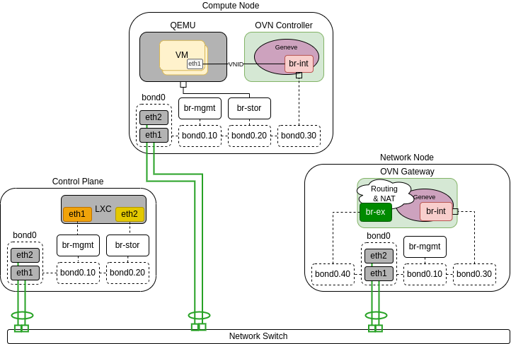
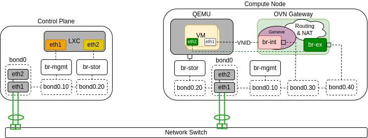
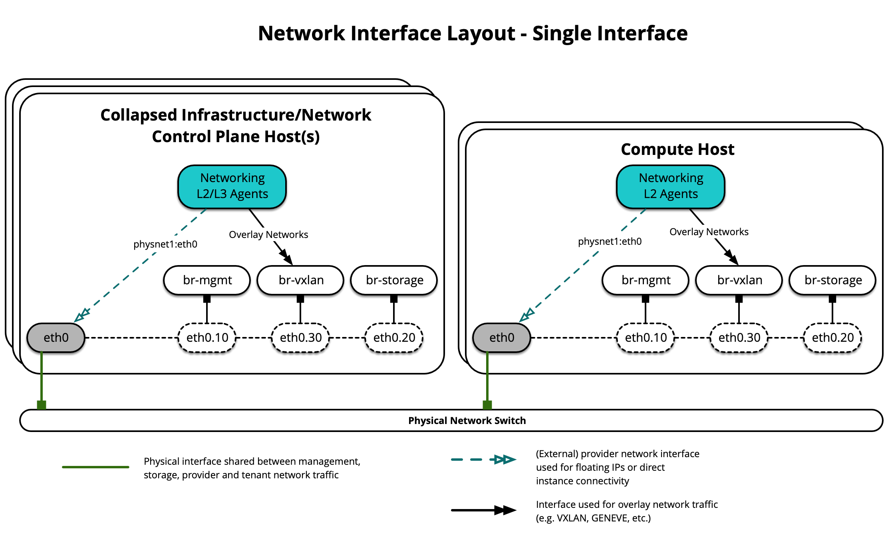
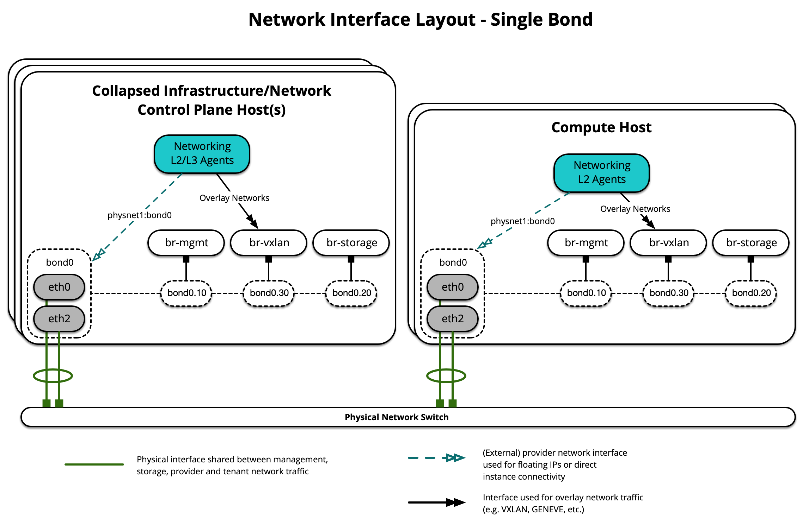
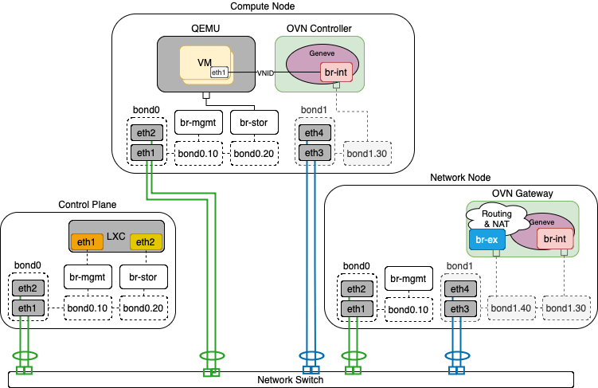
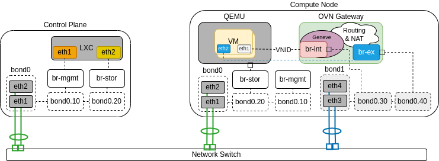
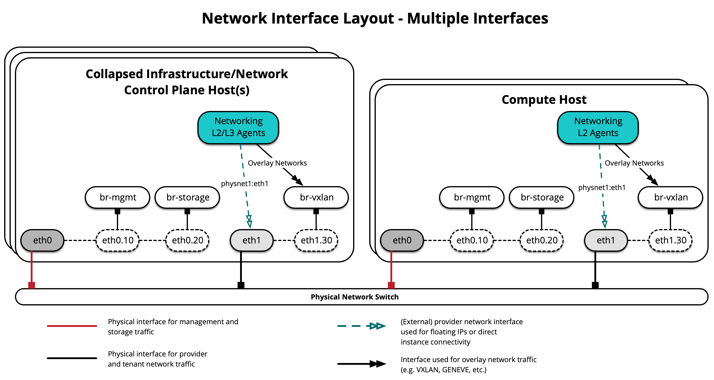
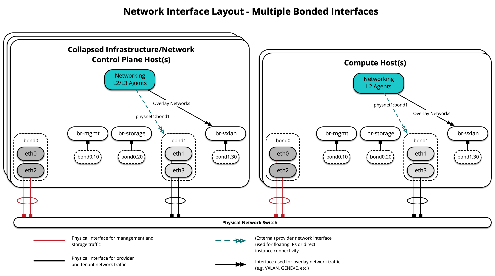

.. _production-network-archs:

=====================
Network architectures
=====================

OpenStack-Ansible supports a number of different network architectures,
and can be deployed using a single network interface for non-production
workloads or using multiple network interfaces or bonded interfaces for
production workloads.

The OpenStack-Ansible reference architecture segments traffic using VLANs
across multiple network interfaces or bonds. Common networks used in an
OpenStack-Ansible deployment can be observed in the following table:

+-----------------------+-----------------+------+
| Network               | CIDR            | VLAN |
+=======================+=================+======+
| Management Network    | 172.29.236.0/22 |  10  |
+-----------------------+-----------------+------+
| Overlay Network       | 172.29.240.0/22 |  30  |
+-----------------------+-----------------+------+
| Storage Network       | 172.29.244.0/22 |  20  |
+-----------------------+-----------------+------+

The ``Management Network``, also referred to as the ``container network``,
provides management of and communication between the infrastructure
and OpenStack services running in containers or on metal. The
``management network`` uses a dedicated VLAN typically connected to the
``br-mgmt`` bridge, and may also be used as the primary interface used
to interact with the server via SSH.

The ``Overlay Network``, also referred to as the ``tunnel network``,
provides connectivity between hosts for the purpose of tunnelling
encapsulated traffic using VXLAN, Geneve, or other protocols. The
``overlay network`` uses a dedicated VLAN typically connected to the
``br-vxlan`` bridge.

The ``Storage Network`` provides segregated access to Block Storage from
OpenStack services such as Cinder and Glance. The ``storage network`` uses
a dedicated VLAN typically connected to the ``br-storage`` bridge.

.. note::

  The CIDRs and VLANs listed for each network are examples and may
  be different in your environment.

Additional VLANs may be required for the following purposes:

* External provider networks for Floating IPs and instances
* Self-service project networks for instances
* Other OpenStack services

Network interfaces
~~~~~~~~~~~~~~~~~~

Configuring network interfaces
------------------------------

OpenStack-Ansible does not mandate any specific method of configuring
network interfaces on the host. You may choose any tool, such as ifupdown,
netplan, systemd-networkd, networkmanager or another operating-system
specific tool. The only requirement is that a set of functioning network
bridges and interfaces are created which match those expected by
OpenStack-Ansible, plus any that you choose to specify for neutron
physical interfaces.

A selection of network configuration example files are given in
the ``etc/network`` and ``etc/netplan`` for ubuntu systems, and it is
expected that these will need adjustment for the specific requirements
of each deployment.

If you want to delegate management of network bridges and interfaces to
OpenStack-Ansible, you can define variables
``openstack_hosts_systemd_networkd_devices`` and
``openstack_hosts_systemd_networkd_networks`` in `group_vars/lxc_hosts`,
for example:

.. code-block:: yaml

  openstack_hosts_systemd_networkd_devices:
    - NetDev:
        Name: vlan-mgmt
        Kind: vlan
      VLAN:
        Id: 10
    - NetDev:
        Name: "{{ management_bridge }}"
        Kind: bridge
      Bridge:
        ForwardDelaySec: 0
        HelloTimeSec: 2
        MaxAgeSec: 12
        STP: off

  openstack_hosts_systemd_networkd_networks:
    - interface: "vlan-mgmt"
      bridge: "{{ management_bridge }}"
    - interface: "{{ management_bridge }}"
      address: "{{ management_address }}"
      netmask: "255.255.252.0"
      gateway: "172.29.236.1"
    - interface: "eth0"
      vlan:
        - "vlan-mgmt"
      # NOTE: `05` is prefixed to filename to have precedence over netplan
      filename: 05-lxc-net-eth0
      address: "{{ ansible_facts['eth0']['ipv4']['address'] }}"
      netmask: "{{ ansible_facts['eth0']['ipv4']['netmask'] }}"

If you need to run some pre/post hooks for interfaces, you will need to
configure a systemd service for that. It can be done using variable
``openstack_hosts_systemd_services``, like that:

.. code-block:: yaml

  openstack_hosts_systemd_services:
    - service_name: "{{ management_bridge }}-hook"
      state: started
      enabled: yes
      service_type: oneshot
      execstarts:
        - /bin/bash -c "/bin/echo 'management bridge is available'"
      config_overrides:
        Unit:
          Wants: network-online.target
          After: "{{ sys-subsystem-net-devices-{{ management_bridge }}.device }}"
          BindsTo: "{{ sys-subsystem-net-devices-{{ management_bridge }}.device }}"

Setting an MTU on a network interface
-------------------------------------

Larger MTU’s can be useful on certain networks, especially storage networks.
Add a container_mtu attribute within the ``provider_networks`` dictionary to set
a custom MTU on the container network interfaces that attach to a particular
network:

.. code-block:: yaml

    provider_networks:
      - network:
          group_binds:
            - glance_api
            - cinder_api
            - cinder_volume
            - nova_compute
          type: "raw"
          container_bridge: "br-storage"
          container_interface: "eth2"
          container_type: "veth"
          container_mtu: "9000"
          ip_from_q: "storage"
          static_routes:
            - cidr: 10.176.0.0/12
              gateway: 172.29.248.1

The example above enables `jumbo frames <https://en.wikipedia.org/wiki/Jumbo_frame>`_ by setting the MTU on the storage
network to 9000.

.. note::

   It's important to ensure that the MTU is consistently set across the
   entire network path. This includes not only the container interfaces but
   also the underlying bridge, physical NICs, and any connected network
   equipment like switches, routers, and storage devices. Inconsistent MTU
   settings can lead to fragmentation or dropped packets, which can severely
   impact performance.

Single interface or bond
------------------------

OpenStack-Ansible supports the use of a single interface or set of bonded
interfaces that carry traffic for OpenStack services as well as instances.

Open Virtual Network (OVN)
++++++++++++++++++++++++++

The following diagrams demonstrate hosts using a single bond with OVN.

In the scenario below only Network node is connected to external network and
computes do not have external connectivity, so routers are needed for external
connectivity:

The following diagram demonstrates a compute node serving as an OVN gatway.
It is connected to the public network, which enables to connect VMs to public
networks not only through routers, but also directly:

Open vSwitch
++++++++++++

The following diagram demonstrates hosts using a single interface for OVS Scenario:

The following diagram demonstrates hosts using a single bond:

Each host will require the correct network bridges to be implemented.
The following is the ``/etc/network/interfaces`` file for ``infra1``
using a single bond.

.. note::

  If your environment does not have ``eth0``, but instead has ``p1p1`` or some
  other interface name, ensure that all references to ``eth0`` in all
  configuration files are replaced with the appropriate name. The same applies
  to additional network interfaces.

.. literalinclude:: ../../../../etc/network/interfaces.d/openstack_interface.cfg.singlebond.example

Multiple interfaces or bonds
----------------------------

OpenStack-Ansible supports the use of a multiple interfaces or sets of bonded
interfaces that carry traffic for OpenStack services and instances.

Open Virtual Network (OVN)
++++++++++++++++++++++++++

The following diagrams demonstrate hosts using multiple bonds with OVN.

In the scenario below only Network node is connected to external network and
computes do not have external connectivity, so routers are needed for external
connectivity:

The following diagram demonstrates a compute node serving as an OVN gatway.
It is connected to the public network, which enables to connect VMs to public
networks not only through routers, but also directly:

Open vSwitch
++++++++++++

The following diagram demonstrates hosts using multiple interfaces for OVS Scenario:

The following diagram demonstrates hosts using multiple bonds:

Each host will require the correct network bridges to be implemented. The
following is the ``/etc/network/interfaces`` file for ``infra1`` using
multiple bonded interfaces.

.. note::

   If your environment does not have ``eth0``, but instead has ``p1p1`` or
   some other interface name, ensure that all references to ``eth0`` in all
   configuration files are replaced with the appropriate name. The same
   applies to additional network interfaces.

.. literalinclude:: ../../../../etc/network/interfaces.d/openstack_interface.cfg.multibond.example

Additional resources
~~~~~~~~~~~~~~~~~~~~

For more information on how to properly configure network interface files
and OpenStack-Ansible configuration files for different deployment scenarios,
please refer to the following:

* :ref:`test-environment-example`
* :ref:`production-environment-config`
* :ref:`provider-network-groups-config`

For network agent and container networking toplogies, please refer to the
following:

* :ref:`container-networking`
