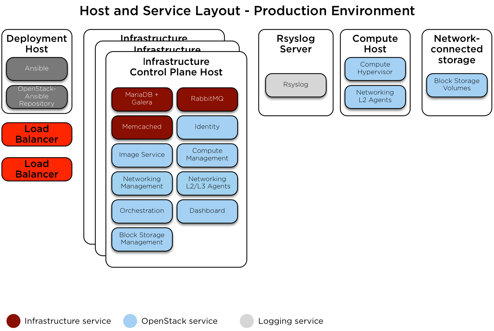

.. _production-environment-config:

======================
Production environment
======================

This is an example production environment for a working
OpenStack-Ansible (OSA) deployment with high availability services.

This example environment has the following characteristics:

* Three infrastructure (control plane) hosts
* Two compute hosts
* One NFS storage device
* One log aggregation host
* Multiple Network Interface Cards (NIC) configured as bonded pairs for each
  host
* Full compute kit with the Telemetry service (ceilometer) included,
  with NFS configured as a storage back end for the Image (glance), and Block
  Storage (cinder) services
* Internet access via the router address 172.29.236.1 on the
  Management Network

Network configuration
~~~~~~~~~~~~~~~~~~~~~

Network CIDR/VLAN assignments
-----------------------------

The following CIDR and VLAN assignments are used for this environment.

+-----------------------+-----------------+------+
| Network               | CIDR            | VLAN |
+=======================+=================+======+
| Management Network    | 172.29.236.0/22 |  10  |
+-----------------------+-----------------+------+
| Tunnel (VXLAN) Network| 172.29.240.0/22 |  30  |
+-----------------------+-----------------+------+
| Storage Network       | 172.29.244.0/22 |  20  |
+-----------------------+-----------------+------+

IP assignments
--------------

The following host name and IP address assignments are used for this
environment.

+------------------+----------------+-------------------+----------------+
| Host name        | Management IP  | Tunnel (VXLAN) IP | Storage IP     |
+==================+================+===================+================+
| lb_vip_address   | 172.29.236.9   |                   |                |
+------------------+----------------+-------------------+----------------+
| infra1           | 172.29.236.11  | 172.29.240.11     |                |
+------------------+----------------+-------------------+----------------+
| infra2           | 172.29.236.12  | 172.29.240.12     |                |
+------------------+----------------+-------------------+----------------+
| infra3           | 172.29.236.13  | 172.29.240.13     |                |
+------------------+----------------+-------------------+----------------+
| log1             | 172.29.236.14  |                   |                |
+------------------+----------------+-------------------+----------------+
| NFS Storage      |                |                   | 172.29.244.15  |
+------------------+----------------+-------------------+----------------+
| compute1         | 172.29.236.16  | 172.29.240.16     | 172.29.244.16  |
+------------------+----------------+-------------------+----------------+
| compute2         | 172.29.236.17  | 172.29.240.17     | 172.29.244.17  |
+------------------+----------------+-------------------+----------------+

Host network configuration
--------------------------

Each host will require the correct network bridges to be implemented. The
following is the ``/etc/network/interfaces`` file for ``infra1``.

.. note::

   If your environment does not have ``eth0``, but instead has ``p1p1`` or
   some other interface name, ensure that all references to ``eth0`` in all
   configuration files are replaced with the appropriate name. The same
   applies to additional network interfaces.

.. literalinclude:: ../../../../etc/network/interfaces.d/openstack_interface.cfg.prod.example

Deployment configuration
~~~~~~~~~~~~~~~~~~~~~~~~

Environment layout
------------------

The ``/etc/openstack_deploy/openstack_user_config.yml`` file defines the
environment layout.

The following configuration describes the layout for this environment.

.. literalinclude:: ../../../../etc/openstack_deploy/openstack_user_config.yml.prod.example

Environment customizations
--------------------------

The optionally deployed files in ``/etc/openstack_deploy/env.d`` allow the
customization of Ansible groups. This allows the deployer to set whether
the services will run in a container (the default), or on the host (on
metal).

For this environment, the ``cinder-volume`` runs in a container on the
infrastructure hosts. To achieve this, implement
``/etc/openstack_deploy/env.d/cinder.yml`` with the following content:

.. literalinclude:: ../../../../etc/openstack_deploy/env.d/cinder-volume.yml.container.example

User variables
--------------

The ``/etc/openstack_deploy/user_variables.yml`` file defines the global
overrides for the default variables.

For this environment, implement the load balancer on the infrastructure
hosts. Ensure that Keepalived is also configured with HAProxy in
``/etc/openstack_deploy/user_variables.yml`` with the following content.

.. literalinclude:: ../../../../etc/openstack_deploy/user_variables.yml.prod.example
