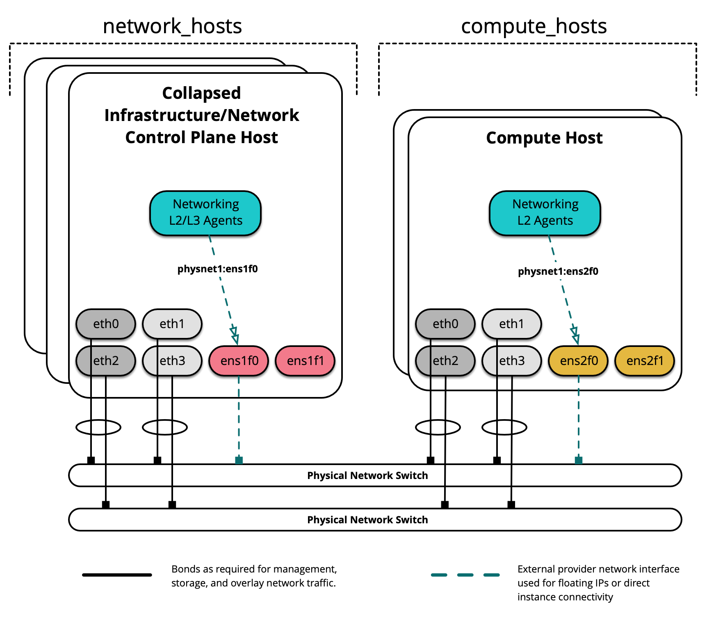
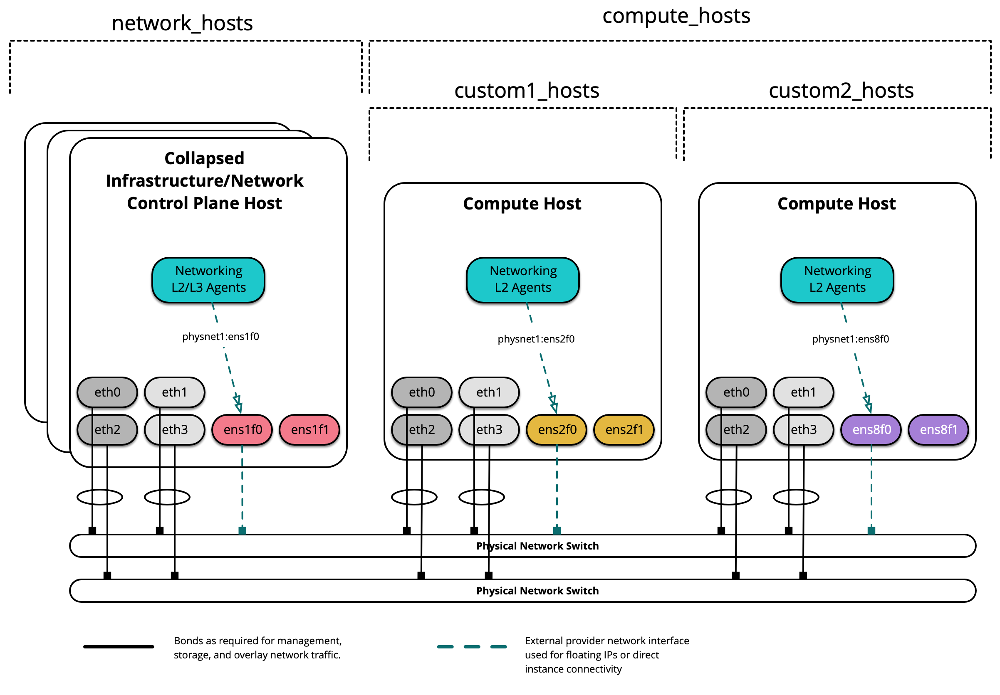

.. _provider-network-groups-config:

=======================
Provider network groups
=======================

Many network configuration examples assume a homogenous environment,
where each server is configured identically and consistent network
interfaces and interface names can be assumed across all hosts.

Recent changes to OSA enables deployers to define provider networks
that apply to particular inventory groups and allows for a heterogeneous
network configuration within a cloud environment. New groups can be created
or existing inventory groups, such as ``network_hosts`` or
``compute_hosts``, can be used to ensure certain configurations are applied
only to hosts that meet the given parameters.

Before reading this document, please review the following scenario:

* :dev_docs:`Production environment  <user/prod/example.html>`

This example environment has the following characteristics:

* A ``network_hosts`` group consisting of three collapsed
  infrastructure/network (control plane) hosts
* A ``compute_hosts`` group consisting of two compute hosts
* Multiple Network Interface Cards (NIC) used as provider network interfaces
  that vary between hosts

.. note::

  The groups ``network_hosts`` and ``compute_hosts`` are pre-defined groups
  in an OpenStack-Ansible deployment.

The following diagram demonstates servers with different network interface
names:

In this example environment, infrastructure/network nodes hosting L2/L3/DHCP
agents will utilize an interface named ``ens1f0`` for the provider network
``physnet1``. Compute nodes, on the other hand, will utilize an interface
named ``ens2f0`` for the same ``physnet1`` provider network.

.. note::

  Differences in network interface names may be the result of a difference in
  drivers and/or PCI slot locations.

Deployment configuration
~~~~~~~~~~~~~~~~~~~~~~~~

Environment layout
------------------

The ``/etc/openstack_deploy/openstack_user_config.yml`` file defines the
environment layout.

The following configuration describes the layout for this environment.

.. literalinclude:: ../../../../etc/openstack_deploy/openstack_user_config.yml.provnet-group.example

Hosts in the ``network_hosts`` group will map ``physnet1`` to the ``ens1f0``
interface, while hosts in the ``compute_hosts`` group will map ``physnet1``
to the ``ens2f0`` interface. Additional provider mappings can be established
using the same format in a separate definition.

An additional provider interface definition named ``physnet2`` using different
interfaces between hosts may resemble the following:

.. code:: console

  - network:
      container_bridge: "br-vlan2"
      container_type: "veth"
      container_interface: "eth13"
      host_bind_override: "ens1f1"
      type: "vlan"
      range: "2000:2999"
      net_name: "physnet2"
      group_binds:
        - network_hosts
  - network:
      container_bridge: "br-vlan2"
      container_type: "veth"
      host_bind_override: "ens2f1"
      type: "vlan"
      range: "2000:2999"
      net_name: "physnet2"
      group_binds:
        - compute_hosts

.. note::

  The ``container_interface`` parameter is only necessary when Neutron
  agents are run in containers, and can be excluded in many cases. The
  ``container_bridge`` and ``container_type`` parameters also relate to
  infrastructure containers, but should remain defined for legacy purposes.

Custom Groups
-------------

Custom inventory groups can be created to assist in segmenting hosts beyond
the built-in groups provided by OpenStack-Ansible.

Before creating custom groups, please review the following:

* :dev_docs:`Configuring the inventory
  <reference/inventory/configure-inventory.html>`

The following diagram demonstates how a custom group can be used to further
segment hosts:

When creating a custom group, first create a skeleton in
``/etc/openstack_deploy/env.d/``. The following is an example of an inventory
skeleton for a group named ``custom2_hosts`` that will consist of bare metal
hosts, and has been created at
``/etc/openstack_deploy/env.d/custom2_hosts.yml``.

.. code-block:: console

  ---
  physical_skel:
    custom2_containers:
      belongs_to:
        - all_containers
    custom2_hosts:
      belongs_to:
        - hosts

Define the group and its members in a corresponding file in
``/etc/openstack_deploy/conf.d/``. The following is an example of a group
named ``custom2_hosts`` defined in
``/etc/openstack_deploy/conf.d/custom2_hosts.yml`` consisting of a single
member, ``compute2``:

.. code-block:: console

  ---
  # custom example
  custom2_hosts:
    compute2:
      ip: 172.29.236.17

The custom group can then be specifed when creating a provider network, as
shown here:

.. code:: console

  - network:
      container_bridge: "br-vlan"
      container_type: "veth"
      host_bind_override: "ens8f1"
      type: "vlan"
      range: "101:200,301:400"
      net_name: "physnet1"
      group_binds:
        - custom2_hosts
