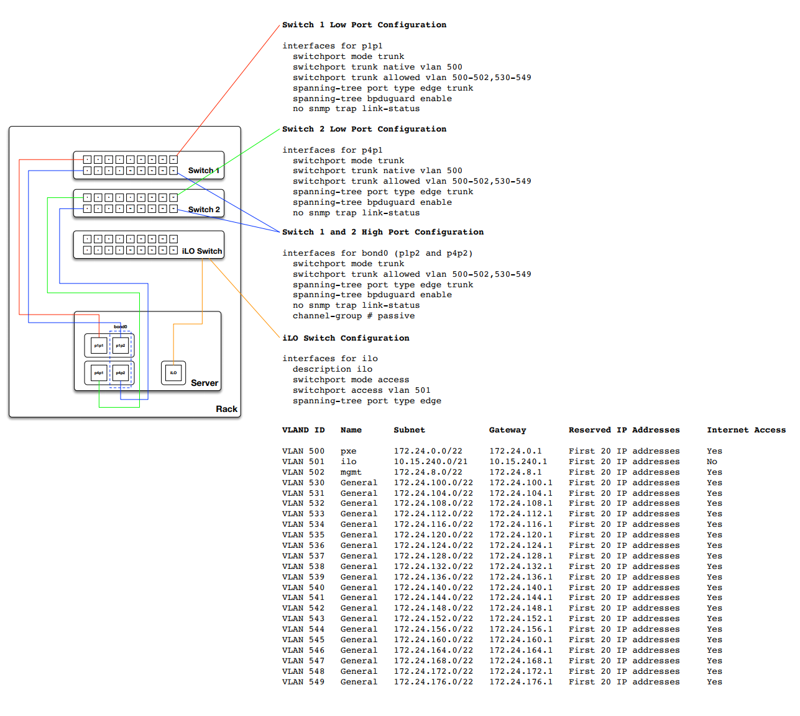

.. _test-environment-example:

========================
Test environment example
========================

Here is an example test environment for a working
OpenStack-Ansible (OSA) deployment with a small number of servers.

This example environment has the following characteristics:

* One infrastructure (control plane) host (8 vCPU, 8 GB RAM, 60 GB HDD)
* One compute host (8 vCPU, 8 GB RAM, 60 GB HDD)
* One Network Interface Card (NIC) for each host
* A basic compute kit environment, with the Image (glance) and Compute (nova)
  services set to use file-backed storage.
* Internet access via the router address 172.29.236.1 on the
  Management Network

.. image:: ../figures/arch-layout-test.png
   :width: 100%
   :alt: Test environment host layout

Network configuration
~~~~~~~~~~~~~~~~~~~~~

Switch port configuration
-------------------------

The following example provides a good reference for switch configuration and
cab layout. This example may be more that what is required for basic setups
however it can be adjusted to just about any configuration. Additionally you
will need to adjust the VLANS noted within this example to match your
environment.

Network CIDR/VLAN assignments
-----------------------------

The following CIDR and VLAN assignments are used for this environment.

+-----------------------+-----------------+------+
| Network               | CIDR            | VLAN |
+=======================+=================+======+
| Management Network    | 172.29.236.0/22 |  10  |
+-----------------------+-----------------+------+
| Tunnel (VXLAN) Network| 172.29.240.0/22 |  30  |
+-----------------------+-----------------+------+
| Storage Network       | 172.29.244.0/22 |  20  |
+-----------------------+-----------------+------+

IP assignments
--------------

The following host name and IP address assignments are used for this
environment.

+------------------+----------------+-------------------+----------------+
| Host name        | Management IP  | Tunnel (VXLAN) IP | Storage IP     |
+==================+================+===================+================+
| infra1           | 172.29.236.11  | 172.29.240.11     |                |
+------------------+----------------+-------------------+----------------+
| compute1         | 172.29.236.12  | 172.29.240.12     | 172.29.244.12  |
+------------------+----------------+-------------------+----------------+
| storage1         | 172.29.236.13  |                   | 172.29.244.13  |
+------------------+----------------+-------------------+----------------+

Host network configuration
--------------------------

Each host will require the correct network bridges to be implemented. The
following is the ``/etc/network/interfaces`` file for ``infra1``.

.. note::

   If your environment does not have ``eth0``, but instead has ``p1p1`` or
   some other interface name, ensure that all references to ``eth0`` in all
   configuration files are replaced with the appropriate name. The same
   applies to additional network interfaces.

.. literalinclude:: ../../../../etc/network/interfaces.d/openstack_interface.cfg.test.example

Deployment configuration
~~~~~~~~~~~~~~~~~~~~~~~~

Environment layout
------------------

The ``/etc/openstack_deploy/openstack_user_config.yml`` file defines the
environment layout.

The following configuration describes the layout for this environment.

.. literalinclude:: ../../../../etc/openstack_deploy/openstack_user_config.yml.test.example

Environment customizations
--------------------------

The optionally deployed files in ``/etc/openstack_deploy/env.d`` allow the
customization of Ansible groups. This allows the deployer to set whether
the services will run in a container (the default), or on the host (on
metal).

For this environment you do not need the ``/etc/openstack_deploy/env.d``
folder as the defaults set by OpenStack-Ansible are suitable.

User variables
--------------

The ``/etc/openstack_deploy/user_variables.yml`` file defines the global
overrides for the default variables.

For this environment, if you want to use the same IP address for the internal
and external endpoints, you will need to ensure that the internal and public
OpenStack endpoints are served with the same protocol. This is done with
the following content:

.. literalinclude:: ../../../../etc/openstack_deploy/user_variables.yml.test.example
